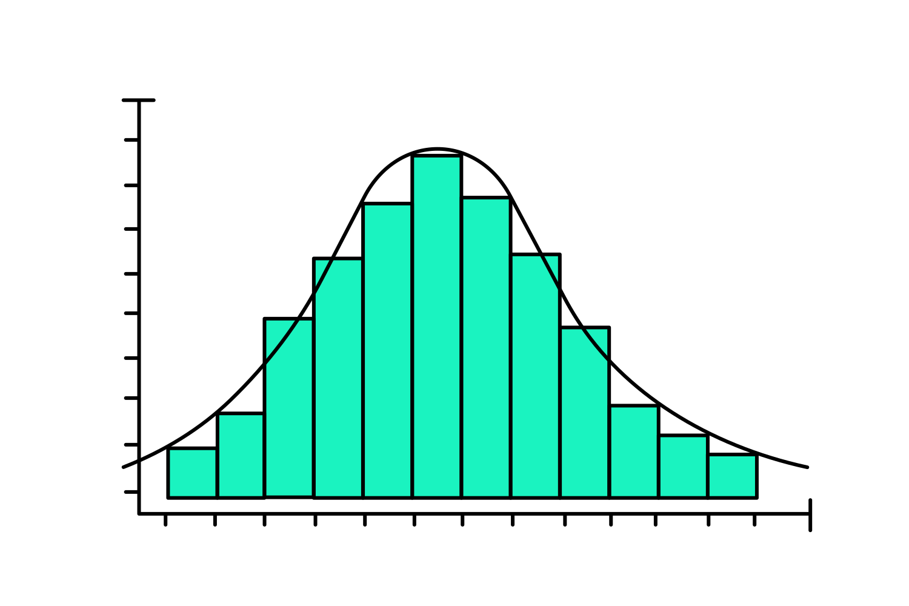
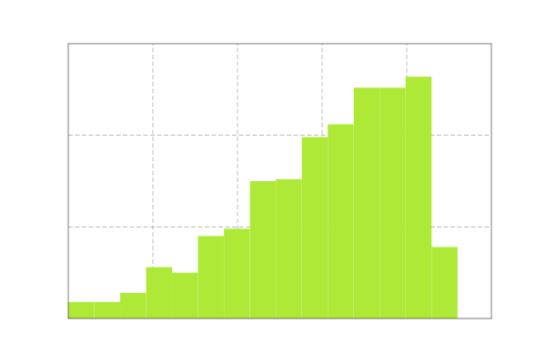
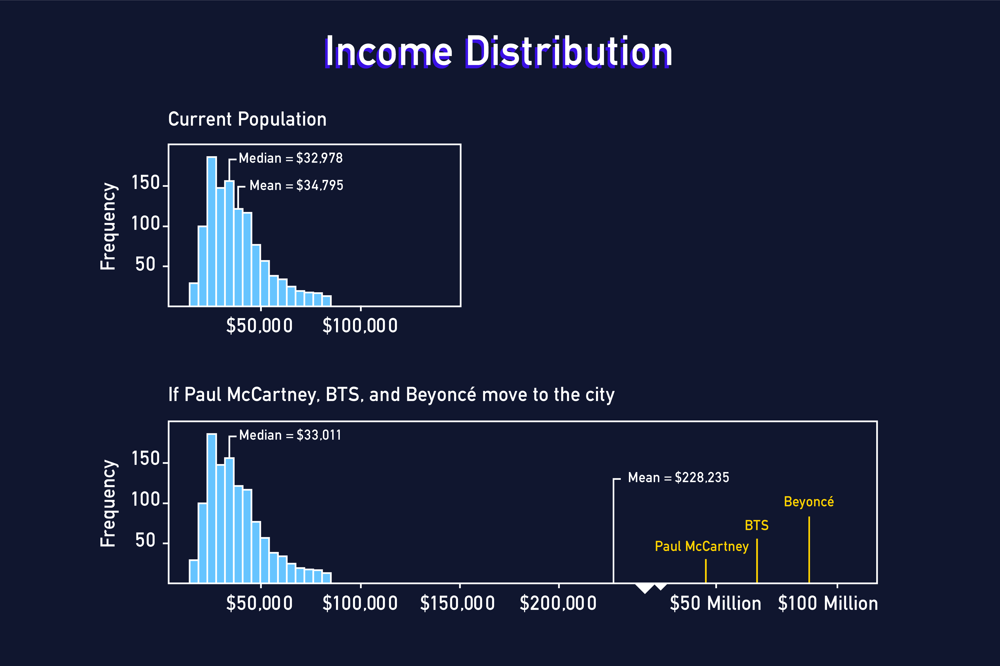

## Introduction

Let's imagine we are working for the city government of the fictional city of Melody Metropolis. The mayor of Melody Metropolis wants to know more about the musicians who currently live in the city. The learning environment shows a dataset we have on musicians living in the city as of last year.

| age | income | title     | experience | instrument | band |
| --- | ------ | --------- | ---------- | ---------- | ---- |
| 40  | 40840  | performer | 13         | guitar     | 1    |
| 54  | 21689  | composer  | 11         | voice      | 1    |
| 37  | 43153  | composer  | 28         | piano      | 0    |

How would you describe this dataset? See if you can answer any of the following questions:

- What does a typical musician's income look like?
- Is there a wide range of musician ages?
- What proportion of the musicians in the dataset play guitar?

We can try to make generalizations by looking over the rows and columns, but it's difficult to answer these questions precisely. We need some kind of "data vocabulary" that can help us measure and describe the variables in the dataset. *Summary statistics* can be used for this exactly purpose. <br />

## Describing Categorical Variables

To start our summary for the mayor, let's describe some of the categorical variables in the musician dataset - those variables that contain qualitative information on the city's musicians. First, let's look at information about the ```title``` variable, which tells us the job title each musician holds. <br />
The following table shows:

- **frequency**: the count of musicians for each job title
- **proportion**: the frequency divided by the total number of musicians
- **percentage**: the proportion converted from a decimal to a percentage

| Title      | Frequency  | Proportion | Percentage |
| ---------- | ---------- | ---------- | ---------- |
| performer  | 333        | 0.35       | 35%        |
| manager    | 113        | 0.12       | 12%        |
| producer   | 87         | 0.09       | 9%         |
| educator   | 239        | 0.25       | 25%        |
| composer   | 186        | 0.19       | 19%        |
| Total      | 958        | 1.00       | 100%       |

From the table, we can learn about the different job titles of musicians in the city. There are 333 performers out of a total of 958 musicians. The proportion of performers is 333 / 958 = 0.35. To make this even easier to understand, we can convert the proportion to a percentage by multiplying it by 100: 35% of musicians in the city are performers. <br />
We can also compare one category to another by checking the ratio of their frequencies. For example, there are fewer managers than performers. Their ratio is 333 performers to 113 managers, which can be simplified by dividing: 333 / 113 = 2.95. This means there are almost 3 performers for every manager in the city.

## Describing Numeric Variables

Now it's time to explore some numeric variables - those with quantitative data. There are a lot of ways we can describe the **distribution** of a numeric variable. A distribution is a function that shows all possible values of a variable and how frequently each value occurs. <br />
The following distribution might be considered bell-shaped or hill-shaped and symmetrical. This is actually a very common pattern and is called a **normal distribution**.

<div style="background-color: white;margin-bottom:32px">
  
</div>

Viewing a plot or knowing a variable is normally distributed gives us some general information, but still nothing specific. We need exact measurements to describe where the center of the distribution is and how wide the values are spread away from that center. There are several sets of statistics we may use for these measurements, and we will need to know when to use which combination.

## Mean and Standard Deviation

<div style="background-color: white;margin-bottom:32px">
  
</div>

- What would you say is the typical age of a musician in Melody Metropolis?
- Are most musicians about this age, or are there lots of musicians of many different ages?

To answer these questions more specifically, we should take some measurements of our variable.

- The **mean**, also called the average, describes the center of a numeric distribution by adding all values and dividing by the count.
- The **standard deviation** describes the spread of values in a numeric distribution relative to the mean. It is calculated by finding the average squared distance from each data point to the mean and square-rooting the result.

The mean age of musicians is 40.6 years and the standard deviation is about 9.3 years. We might interpret this standard deviation as moderate variability in age. Had the standard deviation been 1 year, we might say there's hardly any variability in age. The plot of this narrow distribution might look something like the follwing:

<div style="background-color: white;margin-bottom:32px">
  
</div>

The mean and standard deviation are common choices, especially for normal distributions. Their mathematical formulas have special properties that make them easy to use in other contexts, such as statistical testing. However, the mean and standard deviation are not always the best measurements to describe a distribution.

## Skewed Distributions

As we're moving through the numeric variables in our musician dataset, we come across some interesting details when we inspect the income variable.

<div style="background-color: white;margin-bottom:32px">
  
</div>

| Mean       | Standard Deviation  |
| ---------- | ------------------- |
| $34,795    | $11,971             |

1. We notice that the shape of the distribution is different than the shape of the age distribution. There are quite a few musicians with higher incomes that are creating a longer tail on the right side.
2. We also notice the mean indicates that the typical income is $34,795. This values seems a little high since most of the incomes seem to be between $15,000 and $40,000.

What we have learned is that the income distribution is skewed. A **skewed** distribution is asymmetrical with a steep change in frequency on one side and a flatter, trailling change in frequency on the other. Specifically, the income distribution is right-skewed (also called positively-skewed) because the tail is on the right side. <br />
So why does the mean seem wrong? Remember, the mean is the sum of all the values in the dataset divided by the total count. That sum is made very large by all the higher incomes in that right tail. This makes the mean a greater number than we would like it be. When the data are skewed, the mean may not be the best measure of a typical observation.

<div style="margin-bottom:32px">
  
</div>

A right-skewed distribution has a tail on the right. The higher values for experience in the tail will pull the mean out to be **higher** than the median.

<div style="margin-bottom:32px">
  
</div>

A left-skewed distribution has a tail on the left. The lower values for experience in the tail will pull the mean out to be **lower** than the median.

## Median and IQR

Let's find an alternative measure to the mean. We want to find a value that represents the typical musician income, but we don't want to use the actual values in the computation because the data are skewed. <br />
One method would be to find the middle value when all values are arranged from the smallest to largest. This value is called the **median**, but it's also referred to as the 50th percentile or the second quartile (Q2). <br />
Let's look at this range of data:

6,7,8,9,11,12,13,14,15,17,19,20,24,25,26,28

These are the ages that appear at least once for our musicians. This means at least one musician is one of the ages listed in this set. <br />
The median (Q2) is 14.5 which means half the data points are less than 14.5, and half are greater than 14.5 <br />
These data span 22 values, ranging from 6 to 28. We could use this as our measure of spread, but what if the highest number wasn't 28 but 280? The median would still be 14.5, but now the range is 274 (280-6), which doesn't tell us a lot about the bulk of the data. <br />
A better measurement might be the **interquartile range (IQR)**. A quartile is simply a marker for a quarter (25%) of the data. <br />

- The first quartile marks 25% (Q1 = 10)
- The second quartile marks 50% (Q2 = 14.5 - the median)
- The third quartile marks 75% (Q3 = 22)

The IQR is the difference between Q3 and Q1 (22 - 20 = 12), marking the range of just the middle 50% of the data. <br />

## Outliers and Robust Measures

For our income data, the difference between the mean ($34,795) and median ($32,978) was only about $2,000. You may be wondering: Is the difference ever larger? <br />
Let's imagine some very famous celebrity musicians have all decided to move to Melody Metropolis. We know celebrities make much more money than the typical musician in our dataset. We've added three new incomes to the distribution:

<div style="margin-bottom:32px">
  
</div>

- **$48 million**: Paul McCartney, British musician of the Beatles
- **$57 million**: BTS, South Korean K-pop band
- **$81 million**: Beyoncé, American singer-songwriter

The second plot shows that the median appears almost unaffected by the addition of these three gigantic incomes: the median moves from $32,978 to $33,011. However, the mean makes a drastic change from $34,795 to $228,235. The mean is now well beyond even the maximum in the original distribution. An income of $228,235 is definitely not a great measure of the center of our income distribution. <br />
These celebrities incomes are examples of **outliers**, extreme values that are distant from the rest of the distribution. Just as with skewness, outliers tend to more heavily influence the mean thatn the median. This same pattern occurs with measures of spread: the standard deviation is more influenced by outliers and skewness than the interquartile range (IQR). <br />
Because the median and IQR are NOT heavily influenced by extreme values, we say they are **robust**. Robust statistics are often a better choice to measure the center and spread of a distribution that is skewed or has outliers.

## Aggregate Data

One measure that we haven't covered that is usually talked about alongside the mean and median is the mode. The mode is defined as the value with the highest frequency, but we can also think of the mode as the value where the peak of the distribution occurs. While not great for computations, the mode can help us identify interesting features in a variable. <br />
For instance, there might be more than one mode, such as in our distribution of years of experience. In the following plot, we can see there's one peak near the 10-year mark and another near the 30-year mark. We would call this distribution *bimodal* because it has two modes.

<div style="margin-bottom:32px">
  
</div>

Sometimes bimodal distributions occur when there are differences across categories of another variable. Given that the city seems to have a lot of young people in bands, let's see if this pattern is reflected when we find the mean of each category of the `band` variable.

| Mean (In a band)       | Mean (Not in a band)  |
| ---------------------- | --------------------- |
| 14.4 years             | 26.2 years            |

These means are very different and very close to the locations of the modes in our plot. This indicates that there may be some differences in experience level between these two groups that are showing up in our distribution plots as two peaks. <br />
By making this separation and then summarizing with the mean, we have **aggregated** our data. In this case, we have aggregated by summarizing a numeric variable (`experience`) across each value of a categorical variable (`band`).

<div style="margin-bottom:32px">
  
</div>

## Variable Relationships

Aggregating data is a way of exploring variable relationships. We specifically looked at relationships between a numeric variable and a categorical variable, but we should also examine relationships between two numeric variables. <br />
For example, we might wonder: Does musician income vary with years of experience? To start, we can take a look at a **scatter plot** with experience on the x-axis and income on the y-axis. Each point in the plot represents a musician, and the coordinates of that point are the musician's experience (x) and income (y).

<div style="margin-bottom:32px">
  
</div>

The cloud of points in the plot has a pattern. The points move from the lower left to the upper right part of the plot. In other words, lower levels of experience tend to be associated with lower incomes, and higher levels of experience tend to be associated with higher incomes. The points don't form a perfect line though - there is some variation. <br />
We can describe this relationship more precisely by measuring the **correlation coefficient**. This number ranges from -1 to +1 and tells us two things about a linear relationship:

1. **Direction**: A positive coefficient means that higher values in one variable are associated with higher values in the other. A negative coefficient means higher values in one variable are associated with lower values of the other.
2. **Strength**: The farther the coefficient is from 0, the stronger the relationship and the more the points in a scatter plot look like a line.

The correlation coefficient for income and experience is 0.74 - the relationship is positive and moderately strong.