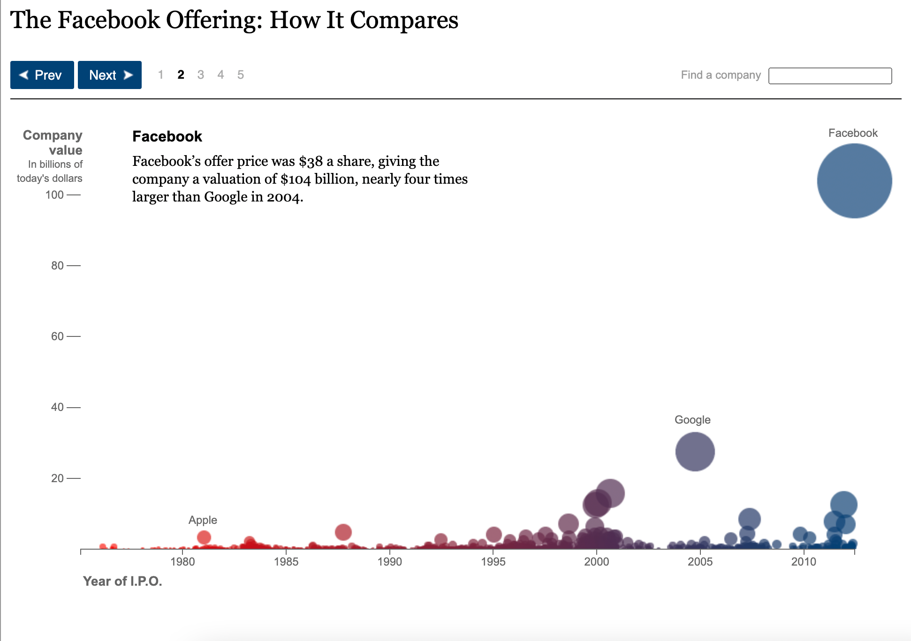

## Introduction

Data visualizations are how we communicate data. We don't read the numbers off a spreadsheet or list every number in a trend to communicate a point - we make a visualization to show them.

## Data Type and Chart Type

The first step of making a data visualization is choosing a chart type. Chart type isn't our only tool when it comes to visualizing data, but it's an important one for communicating about the relationship we want to show.  
In this context, a "relationship" in the data could mean something like...

1. "the shop's sales of Gouda were higher in 2021 than any year since 2006"
2. "30% of people ordered pizza with pineapple"
3. "most people in the sample have a shoe size between 6 and 10.5"
4. "as temperature increases, ice cream sales increase"

The first example is a change over time - that can be perfect for a line chart or a bar chart.  
The second example compares a part to the whole: 30% of people got pizza with pineapple, out of 100% of people who ordered pizza. A pie chart is the classic (sometimes controversial) choice, but newer options include waffle and donut charts.  
The third example is a distribution - the spread of data points in one variable. A histogram is the classic choice for visualizing a distribution.  
The fourth example is a direct comparison of two variables to help understand a trend. This is perfect for a scatterplot, with or without a trend line.  
There's often more than one possible chart we can use for a dataset. But different charts emphasize different questions, arguments, or relationships in the data, and whichever we choose should help translate that data relationship into a visual relationship.

  

## Univariate Charts

One big consideration when choosing a chart type is how many variables we're comparing. **Univariate** charts help us visualize a change in **one variable**.  
Often that means measuring "how much", which can either be a **count** or a **distribution**.  
A common chart for counts is the bar graph. If we want to compare an amount between different categories, like "how many of each coin is in the piggy bank" or "how many birds were saved by species", a bar chart translates the difference in count to a difference in bar height. Remember, **the data relationship is translated to a visual relationship**.  
Another common univariate chart is the histogram. Histograms measure the distribution or spread, of a variable.  
Histograms are a great way to show the concept of a normal (or skewed) distribution. We can visualize the answer to questions like...

- "how does foot size vary across the population?"
- "what is the distribution of pregnancy length across the human population?"
- "how is income distributed in my country?"

A density curve also visualizes a distribution, without putting data in bis like a histogram does.  
A more "math-forward" way to visualize distributions is a box plot or violin plot. These visualizations make percentile and quartile values obvious.  
Last up, outside the counting and distribution category, let's consider a univariate map. This would be a map where the only variable is geographic, i.e. a map that just shows us location and distance.

  

## Bi- and Multivariate Charts

Next up, bivariate and multivariate charts! These charts show the relationships between two or more variables.  
The classic bivariate example is the scatter plot - one variable on the x-axis, another on the y-axis, and each point helps us compare the two variables by its position on the graph.  
Scatterplots translate the relationship between two variables in the data into an easy-to-see spatial relationship. Because we're relying on the idea that each variable increases as we move up the X or Y axis, the scatterplot only makes sense for numeric variables, not categorical.  
A line chart is another common bivariate chart, often measuring a variable changing over time. A stock chart, for example, measures the value of a company over time.  
A line chart with multiple lines for different variables is a multivariate chart. For an example, check out the line chart that plots both imported and domestic cheese sales.  
Last but not least, let's think about a bivariate map. It shows a basic geographical map plus an additional variable - this example shows roughly where different pasta shapes originated in Italy. We can also map precipitation, altitude or depth, median income, museum locations, or combinations of variables... the list is endless.  
Charts often rely on visual signifiers besides chart type to visualize additional variables in the data. For example, the lines on a multivariate line chart are distinguished by pattern and color, and a scatterplot can use color, shape, or dot size to make a third variable apparent.

  

## Aesthetic Properties I: the Menu

Now we'll talk about how we use aesthetic properties to futher clarify and visualize the "details" of the data.  
Aethestic properties are the attributes we use to communicate data visually:

- Position
- Size
- Shape
- Color / Pattern

The following example is a visualization published by The New York Times in 2012 and it shows different tech IPOs.  
Take a minute to look at the graph and see how position, size, shape, and color are used. What does it mean for a data point to be up and to the right versus down and to the left? What do bigger and smaller signify? How does shape come into play? What does color mean?  
We can start with position: from left to right (the x-axis), the graph measures time. From bottom to top (the y-axis) the graph measures company value in billions of dollars.  
As far as shape goes, there's only one here - circles.  
Moving on to size, it looks like the size of each circle tracks with its company value. Companies with a larger IPO amount get a bigger circle.  
Finally, color corresponds to time. Earlier corresponds to red, and later to blue. The middle portion, around 1995, is purple. This visually separates the three decades into three general zones.

  

## Consider the Audience

The best data visualization helps us to understand what's in the data, draw meaningful conclusions, and make decisions about the next steps. This requires context and **different context is appropriate for different audiences**.  
Let's walk through an imaginary-world example:  
Shinji, Paola and Raj work together in an ecology lab. Their lab is applying for funding for a field reserach trip next year. This week, each of them will present the lab's work and data to a different potential funder:

- Sir Avon Rattleborough, retired ecologist and expert field researcher
- Claude Tuber, board game developer and eccentric venture capitalist
- Milana Diamante, heiress and amateur biologist

The three labmates know they'll have to communicate differently to each of these potential funders. **They'll communicate the same information, but each lab member will personalize their chart with a title and annotations that work best for their intended audience**.

## Accessbility Basics

The most commonly discussed accessibility concern is color, since color blindness affects 1 in 12 males and 1 in 200 females.  
The big takeaway when designing for color accessibility is to think not only about the **hue** of a color (e.g. red, green or purple), but the **value** as well (e.g. bright red, light green, dark purple). **Good color comparisons use high contrast values, not just different hues**.  
It's also important to use readable fonts in readable sizes, and make sure they're web-accessible if online.  
Finally, for online data visualizations, make sure to include alt text as we would for any web image. Alt text ensures that users experiencing a visualization through a screen reader won't miss out on whatever information it contains.

## Owning the Role of Author

It can feel unnatural to "speak for" the data, and many authors worry that they will influence their audiences by including annotations. But that's just it! **Data does not speak for itself**, and often, the author of a data viz is the person in the best position to create insightful, helpful annotations.  
In fact, this context isn't only helpful - very often, it's the ethical way to present information. Providing context or even a written summary of what a graph shows helps to limit false conclusions, misinterpretations, and misinformation.
