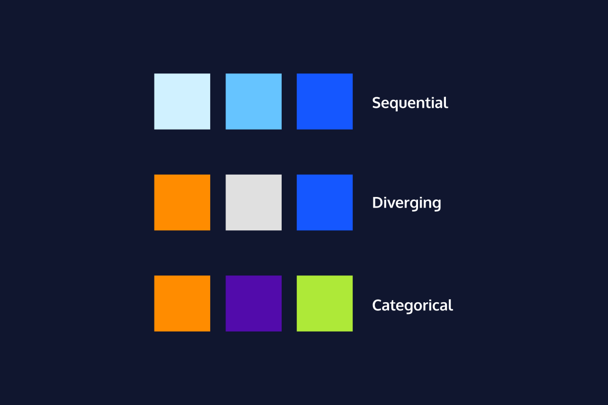

## Introduction

Anyone who has ever learned geography from a map has learned something "wrong". Mapmakers have known for hundred of years that it's just not possible to transfer the earth's 3D information to a 2D map without changing the shape or size of the continents and oceans - something has to be sacrificed.  
The same idea is true in data visualization. Data visualizations take information from the living, breathing world that we inhabit and show it to us in just a few square inches of screen or paper. That always involves prioritizing speed, or accuracy, or sample size, or cost, or another factor, at the expense of something else.  
While the best graphs really do teach us something new, and help us understand a deeper truth using data, graphs can also be misleading, both intentionally or unintentionally. We shouldn't ever assume that a data visualization shows us the truth, the whole truth, and nothing but the truth.  

## Axes

Let's start with axes - the x-axis (horizontal, left-right) and y-axis (vertical, top-bottom). A common misleading aspet of an axis is a **break**. A break starts the count at a number that's not zero, or jumps ahead - this can distort the amount of difference between data points by removing context, and make small differences in a data seem bigger.  
So what to do? If you're looking at a graph, take a second to check where the axis start. If there's a break, factor that in as you think about what the numbers mean.  
If you're making the graph, instead of using a big break...

- Keep enough context to view differences **in proportion** to a meaningful amount, OR
- Make two graphs, one without a break and one "zoomed in", OR
- Choose a visualization type that shows the change, rather than the raw numbers.

  

## Scaling

Scaling refers to the distance between numbers on an axis. Almost all graphs use a **linear scale**, where the numbers count up by a consistent interval - tenths of a centimeter or millions of dollars, if it's the same interval, it's a linear scale.  
The other scaling option is a **logarithmic scale**, a.k.a. log scale. The log scale is common for showing exponential growth that won't fit on the page with a linear scale, but it's almost never a good choice for a general audience. Unless people use log scales regularly, they tend to have trouble interpreting them correctly.  
Check out the graphs in the LE to see how the pharmaceutical company Purdue infamously used this misinterpretation to their advantage in teh early 2000s. The linear scale shows how the concentration of a painkiller drug spikes sharply in the bloodstream at higher doses - the log scale makes it look like all doses behave pretty similarly.  

  

## Color Scales

Color is often the first thing we register when looking at data visualizations. There are three types of color scales, used for the three major types of relationships we can visualize with color.  
Sequential scales are colors in a sequence - often, this is the same hue with more and more white added to or taken away from the color. Sequential scales are used to show a variable increasing or decreasing in intensity or amount, like income, depth, or percent of population that owns a chinchilla.  
Divergent scales are anchored by colors from opposite sides of the color wheel, a.k.a. complementary colors. A divergent scale is used to visualize data where the middle is a baseline, and either side represents a contrasting change. For example, divergent scales do a good job of showing a positive/negative swing in voting or polling, temperatures below and below freezing, or gains and losses over time.  
Categorial scales use a variety of colors to differentiate categories without assigning a rank or order to them. In other words, "purple" doesn't necessarily mean more than "green" - the two are just different colors. Categorical scales are for categorical data, like types of vegetables in a supermarket, or different treatments tested in a controlled study, or organizational blocks on a calendar.

  

## Color Associations

Once we've picked the right color scale, there are still a few more considerations to be made to reduce confusion.  
First up, we tend to view darker colors as "more" and lighter color as "less". For example, if we're visualizing which US states have the most pet ferrets, California - with the most pet ferrets of any state - should be the darkest state on the map. When this scale is reversed, people will tend to just read the graph wrong rather than reading the legend carefully.  
We also come to data visualizations with pre-existing associations for certain colors. These can be culturally specific (red means bad vs. red means lucky), or influenced by the norms for a particular field (red means negative financial balance).  
Sometimes it's good to stick what's recognizable: it would be confusing for US voters if a major newspaper decided to visualize Democrats in red and Republicans in blue, since these colors are overwhelmingly associated with the opposite party.  
But in other cases, switching up colors that have existing cultural associations can reduce harmful stereotyping. Using pink for women and blue for men reinforces an outdated, binary view of women as soft and passive, and men as strong and unemotional. This design choice will not only turn off some viewers, it may also distract on a graph where gender is a relevant variable but not the whole focus.

  

## Labels and Titles

A good title is one of the best and fastest tools for making a more understandable visualization. Lots of confusion can be saved with a descriptive title.  
If the graph doesn't have a good title (or even a title!), viewers have to do more legwork to first figure out what each axis measures and then what the data points show.  
The title can be a question that visualization answers, like, "Who speaks more in Disney movies, male or female characters?".  
Titles can also be a statement of what the visualization shows, like "Comparing denim inseam lenghts through the decades" or "Millennials really do spend more on rent than on avocados" or "The effect of hunger on mood level."  
Like a good title, annotations on a graph also help the viewer to understand what's going on. Annotations are perfect for calling out points of interest, explaining outliers, or including background information that a viewer won't necessarily know from just looking at the graph.  
Check out this *Live Births* graph from FlowingData to see how much value the annotations add. They...

- add detail to the highest and lowest points on the graph
- explain what the 0% baseline means
- provide a caveat for the 2021 data
- reinforce in words that the percents on the y-axis show "more births" and "fewer births".

  

