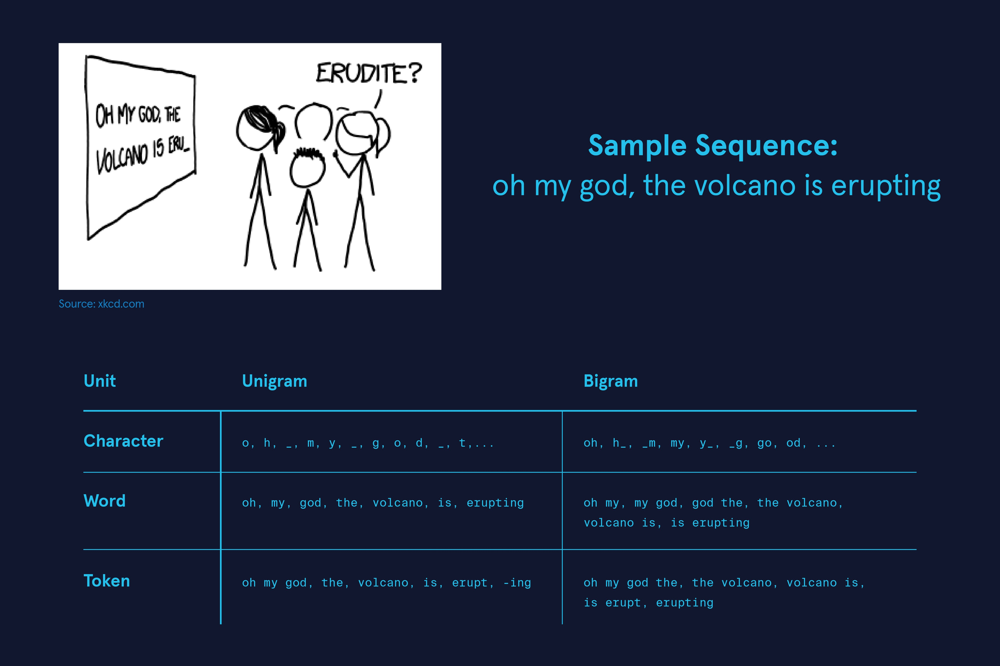
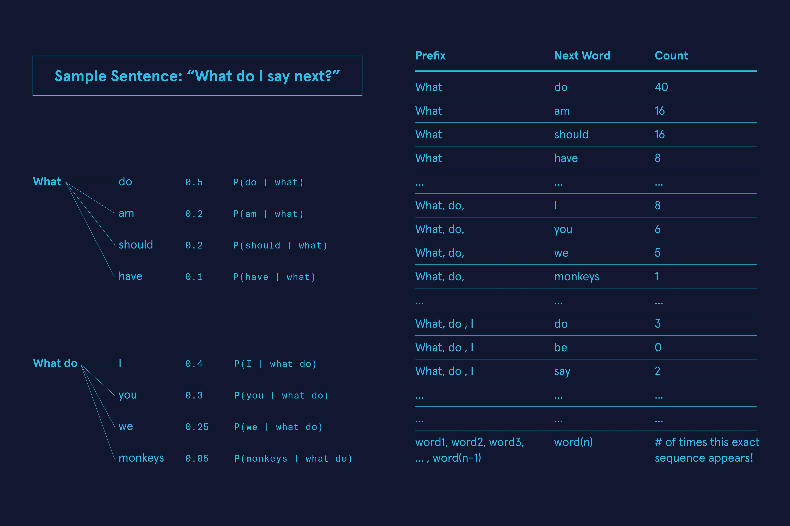
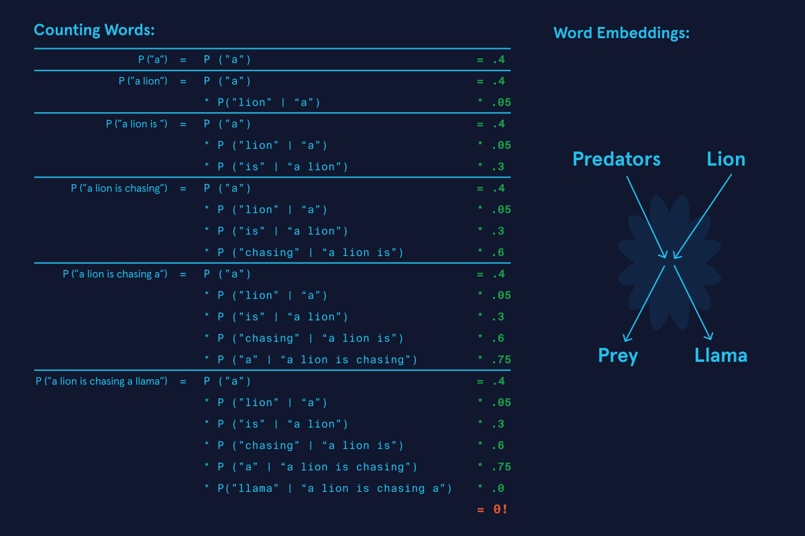
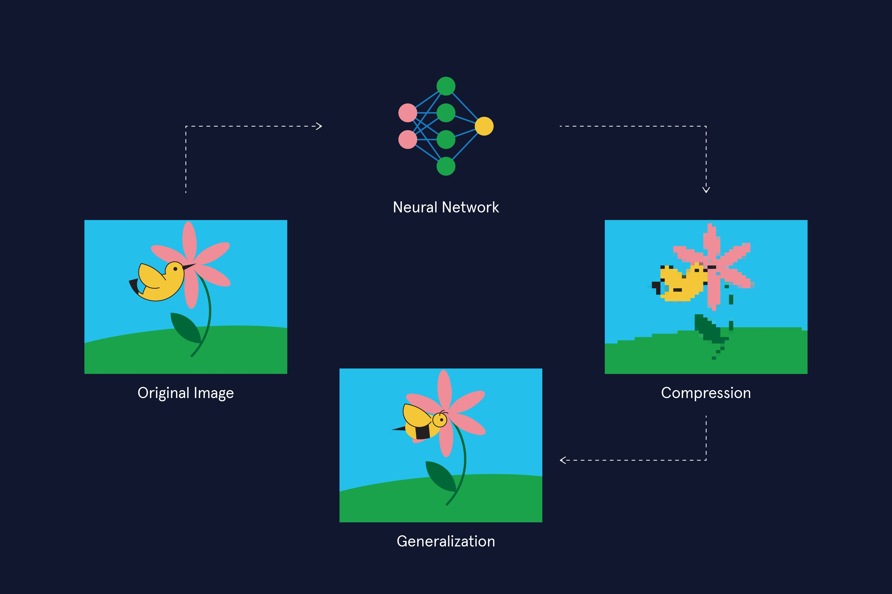
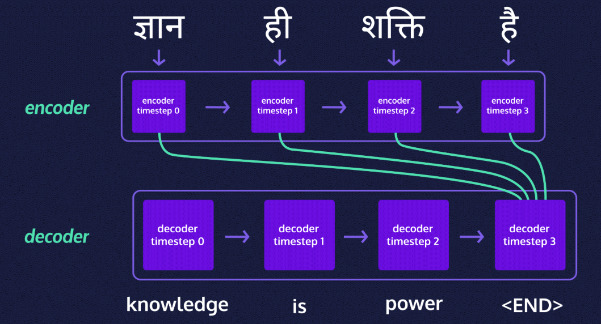
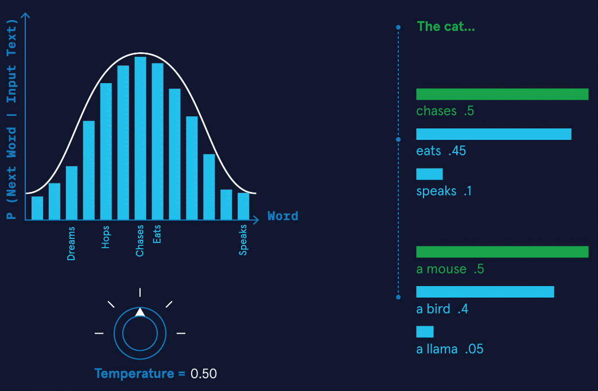
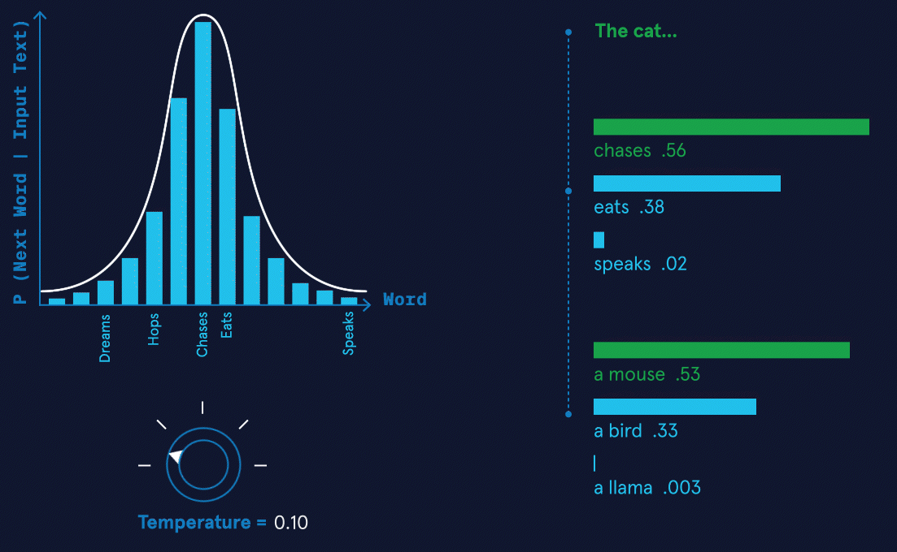
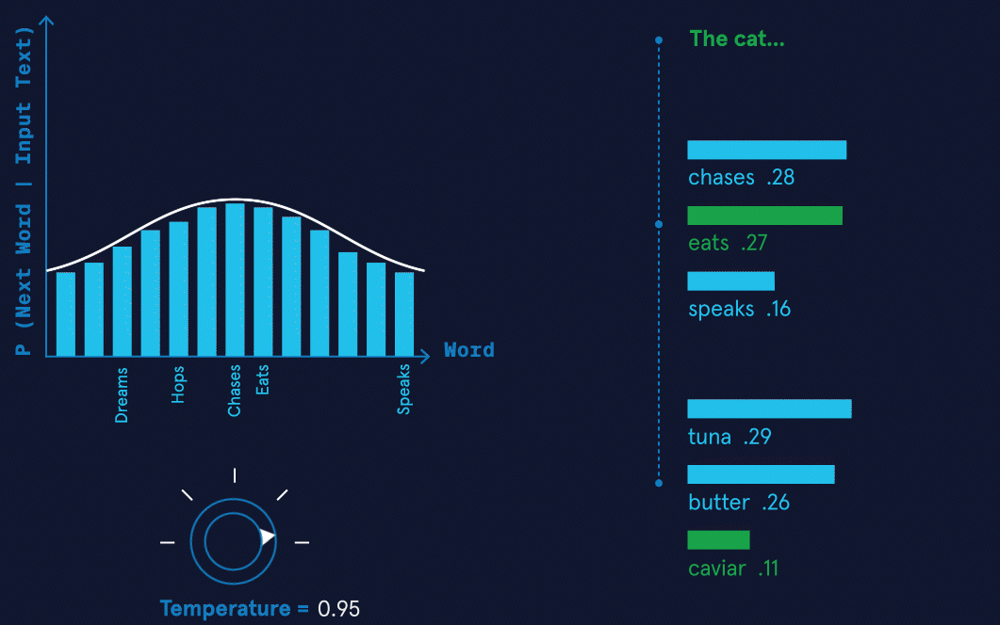
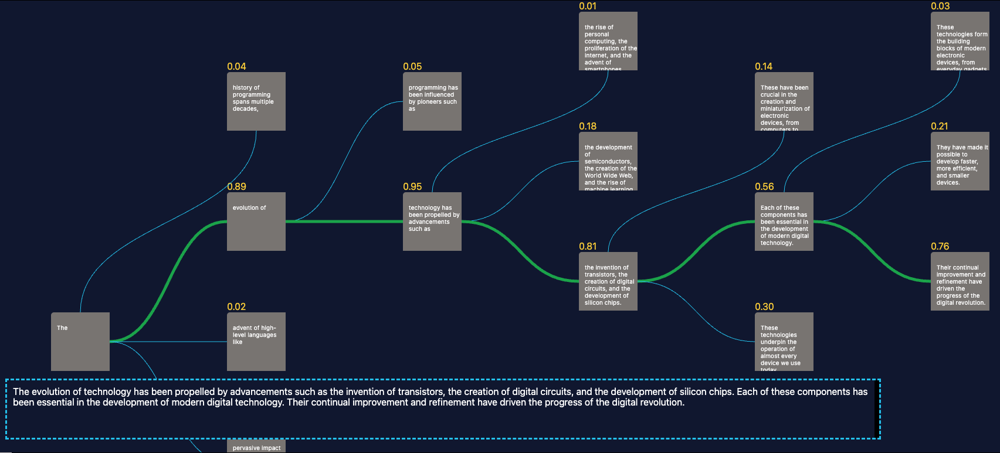

# Large Language Models (LLMs)

Before we jump into how today's models function, we'll start back in 1966 to understand the history of chatbots, text generation, and the Turing test.

## The ELIZA Effect

The first digital chatbot, ELIZA, debuted on the Massachusetts Institute of Technology (MIT) campus in 1996. It was programmed by using binary code by computer scientist Joseph Weizenbaum. The program generated text by following a few simple rules. These rules were based on a pre-determined "script" that allowed it to assume a specific persona. <br />
For instance, the version of ELIZA that impressed staff and students alike at MIT was known as "DOCTOR", a kind of barebones psychoterapist who would mirror back statements typed in by the user of the program. So if someone typed in "I'm feeling X", DOCTOR would respond with something like "What is making you feel X?" <br />
ELIZA was very successful in convincing people that they were interacting with a human and not a computer! So much so that there's even a psychological effect named after the program, the *ELIZA effect*. It referes to the tendency to unconsciously attribute "humanness" to (or *anthropomorphize*) computer behavios.

## The Turing Test

Chatbots have come a long way since the days of ELIZA. From a computer sciencie perspective, ELIZA and CHATGPT can both be said to pass what is known as the "Turing test". <br />
In 1950, computer scientist Alan Turing wrote a landmark paper titled "Computing Machinery and Intelligence", in which he investigated the question:

```
What does it mean for machines to think?
```

He concluded that this question was fundamentally meaningless and said that the better question to ask would be:

```
Can a machine successfully imitate human behavior so that it might dupe a human?
```

To answer this question, he devised a game. The "imitation game", as he called it, has a human evaluator interacting with a machine and another human through a text-only channel. A machine is said to do well at the imitation game if the human evaluator is convinced that they were interacting with another human and not a machine. The imitation game is referred to today as the Turing test.

## "AI": what is it?

The Turing test has been a cornerstone in computer science to assess the intelligence of a machine and a lot of the detail lies in the design of the test itself. Six years after Turing's paper was published, a group of scientists put together a proposal for a Summer Research Project on Artificial Intelligence (AI) at Dartmouth, often thought of historically as the moment that birthed the field of AI. <br />
Instead of trying to define what AI is or is not, they sought to explain the fundamental assumption behind the pursuit of AI:

```
“The study is to proceed on the basis of the conjecture that every aspect of learning or any other feature of intelligence can in principle be so precisely described that a machine can be made to simulate it.”
```

Specifically, they were interested in how language might be useful in this pursuit:

```
“An attempt will be made to find how to make machines use language, form abstractions and concepts, solve kinds of problems now reserved for humans, and improve themselves."
```

From ELIZA to CHATGPT, the abilities demonstrated by language-based technologies have indeed increased in sophistication, nuance, and complexity. What has made this possible was the move away from "rule-based" chatbots and towards language models that rely on neural networks to capture statistical regularities within language.

## Detecting Patterns in Text

The quest to mathematically model language dates back over a hundred years. In 1913, mathematician A.A. Markov analyzed letters in a Russian novel and found that some surprising patterns could be captured by mathematics. Computer scientist and mathematician Claude Shannon followed up on this analysis a few decades later with a broad question about language patterns: *Can we predict the next letter given a series of letters?*

### Next Letter Prediction

For example, consider the XKCD comic shown below, with the three-letter sequence "eru-". Only a few English words begin with this combination of letters, and they are rare. The words "erudite", "erupt", and the less often used "eructate" are a few possible candidates, for instance. <br />
The context of the sentence also narrows down the possibilities for which word can occur next and still make sense. The appearance of "volcano" implies that some variation of the verb "erupt" might be an obvious choice. The verb tense (in this case, present continuous) gives the final clue that the word "erupt" will appear in the form "erupting".

<div style="margin-bottom:32px">
  
</div>

### Natural Language Processing (NLP)

The explanation above relied on familiarity with the English language. Specifically, we relied on the patterns in language we've picked from reading and speaking to inform our thinking as we solved this. Can we train algorithms to do the same, possibly faster and on many sentences simultaneously? The answer is an emphatic yes, and this is the primary goal of the field of "Natural Language Processing" (NLP)! To automate this process using a computer, we must devise a way to turn this text into math.

```
Many initial steps in any NLP task involve standardizing things (i.e., treating language more like numbers, which lend themselves more easily to math) so that computers can analyze text.
```

### From Letters to Words to Tokens

What is the most straightforward language unit to which text can be broken down? A letter! A single-letter unit is known as a "unigram". The sentence "Oh my god, the volcano is eru-" can be broken down into a series of unigrams as follows: {`o`, `h`, `_`, `m`, `y`, `_`, `g`, `o`, `d`, `_`, `t`, `h`, `e`, `_`, `v`, `o`, `l`, `c`, `a`, `n`, `o`, `_`, `i`, `s`, `_`, `e`, `r`, `u`} where the dashes (`_`) represent blank spaces. We could also break it up into two letter units, known as bigrams: where the units would look like {`oh`, `h_`, `_m`, `my`, `y_`, `_g`, `go`, `od`, `d_`, `_t`, `th`, `he`, `e_`, `_v`, `vo`, `ol`, `lc`, `ca`, `an`, `no`, `o_`, `_i`, `is`, `s_`, `_e`, `er`, `ru`} or three letter units, i.e. trigams and ultimately n-letter units, known as n-grams. <br />
The best choice of the unit length depends on the exact problem we're trying to solve, and there are many best practices to follow around this. Formalizing language this way allows us to build a language model on a computer to predict the next best unigram, bigram or n-gram. <br />
Can we do this with only letters? Words are a more natural language unit; we could use them as our smallest unit. We can identify each word unit by the appearance of the spaces between them. The [Google n-gram viewer](https://books.google.com/ngrams/) uses words as language units to give us statistical insights into the appearance of words in Google Books. <br />
We could also use groups of words or subwords (like -ing, -ed, etc.), often referred to as **tokens** in the context of language models. <br />
The table above shows what this might look like for the sentence in the comic.

## Autoregressive Language Models

We've seen previously that the first step in any NLP task is to figure out how to turn text into numbers so we can do math with it. Before getting to the math, let's consider which tasks are well-suited for NLP. Some well-known language-related tasks that NLP algorithms are involved in are:

<ul>
  <li>translation (like in Google Translate)</li>
  <li>completing letter sequences (autocomplete, for instance)</li>
  <li>question-answer (customer service chatbots, for example)</li>
  <li>sentiment analysis (used in content filters)</li>
</ul>

While there are many methodologies in NLP to do these tasks, the quest to build an algorithmic system that can do all of these tasks and more excites NLP researchers the most. Such a model is referred to as a **language model**. Since language is often the vehicle of human thought, the hope is that in building larger language models, an algorithmic system might exhibit a kind of generalized intelligence that's worthy of comparison to humans. <br />
Language models can get large and complex, but, the modelling process begins with a very simple question: Given some text data to work with, how can one build an algorithm to predict the next best thing to say? As it turns out, a model that answers this question well is capable of doing many other language-related tasks! Text data can come in many forms, such as a book, a collection of articles, a set of websites, etc. It is often called as a *corpus* in NLP to indicate that it is likely gathered from many sources and digitally stored. <br />
The word **autoregressive** refers to statistical models that predict future values based on past values. It is used very often in the context of language models and it means that we're using previously occurring words (or word sequences) to predict the next best thing to say. The simplest way to build a language model from a text corpus is to build a giant lookup table. This table contains all possible word combinations appearing in the text and their frequency of appearance so we can easily look up how likely it is that a given sequence occurs in the text. Such a model is often referred to as a **count-based language model**.

## Count-based Autoregressive Language Models

Let's examine this with an example. Consider a text corpus from which we want to predict how likely it is that the sentence "What do I say next?" appears. We would build a giant lookup table like the one shown below. The questions we would try to answer would be in the following order:

```
- How likely is it that the word `what` appears?
- How likely is it that the word `do` appears after the word `what`?
- How likely is it that the word `I` appears after the sequence `what do`?
```

... and so on! <br />

<div style="margin-bottom:32px">
  
</div>

The mathematical way of looking at this would be through *probabilities*. In the figure show above, the symbol `P(do | what)` refers to what is known as a *conditional probability*:

```
`P(do | what)` is the probability that the word `do` appears given that the word `what` has already appeared. 
```

How can we calculate this? From the lookup table we see four possibilities with varying frequencies of occurrence: "what do" appears 40 times in the text; "what am", 16 times; "what should", 16 times and "what have", 8 times. So we can estimate the probability, `P (do | what)` (to be read out aloud as *P of "do" given "what"*) thus:

$$
P(\text{do} \mid \text{what}) = \frac{40}{40 + 16 + 16 + 8} = \frac{40}{80} = 0.5
$$

Now, the probability that the sequence "what do" appears is not just `P (do | what)` but rather:

$$
P(\text{what}, \text{do}) = P(\text{do} \mid \text{what}) \times P(\text{what})
$$

i.e., the probability that the word "what" appears to begin with, multiplied by the probability that it is followed by "do". <br />
Expanding this further, the probability that the sentence "What do I say next?" appears in this corpus of text would be:

$$
P(\text{what}, \text{do}, \text{I}, \text{say}, \text{next}) = P(\text{what}) \times P(\text{do} \mid \text{what}) \times P(\text{I} \mid \text{what}, \text{do}) \times P(\text{say} \mid \text{what}, \text{do}, \text{I}) \times P(\text{next} \mid \text{what}, \text{do}, \text{I}, \text{say})
$$

This is known as the **chain rule of probability**. <br />
While this approach is intuitive, it has some serious limitations. The first is that it requires us to store the counts of every possible sequence of words in the text. As the text corpus grows, the number of possible sequences grows exponentially, making it impossible to store them all in memory. The second limitation is that it requires us to have seen every possible sequence of words in the text to make a prediction. If we haven't seen a particular sequence of words, we can't make a prediction. <br />
These limitations are what led researchers to develop more sophisticated methods for building language models.

## Generalization: From Count-based to Neural Language Models

What happens if a sentencer never occurs in the text that a count-based language model is trained on? Consider a sentence that is highly unlikely to occur in known text like the following:

```
A lion is chasing a llama.
```

It's rather unlikely for these two animals to interact in real life, since they exist on different continents, and even less likely that there is a piece of writing describing such an event. It is *conceivable* however, that a predator like a lion *could hypothetically* chase a domesticated animal like a llama. But a count-based language model will assign a zero probability if this *exact* sequence of words doest not appear in the text it has been exposed to! <br />
The inability to work with possibilities that do not appear in training data is because count-based models are unable to *generalize*. Generalization is the ability of a model to adapt to new and unseen data. In the context of language models generating text, it means that they can produce text that doesn't exist in its training data. <br />
To get a language model to generalize, we would need to **move beyond counting words** and instead, find a way to link words to their meaning and context. This type of model uses **semantics** (i.e., what words mean) rather than counting (which words exist in text). For instance, a semantic language model might map "lions" to the idea of predators and "llamas" to cattle/prey/domesticated animals. This allows it to use the connection that predators chase prey and even assign a non-zero probability for lions chasing llamas. This is often known as a "semantic representation". The mathemical objects that allow language models to generalize this way are known as **word embeddings**. <br />
Word embeddings allow us to turn each word into a series of numbers, also known as a word vector. These vectors exist in an abstract space where words are semantically linked, i.e., they're linked by the meaning and context in which they appear. This makes for a more sophisticated model. One example would be the way it treats homonyms, i.e., two words that have the same spelling but different meanings. For instance, the word "lead" is different when paired with the word "President" than it is when paired with "pipe". A language model using word embeddings would be able to distinguish between homonyms. <br />
The most popular and efficient way to build such embeddings from text is using **neural networks** and language models built using neural networks are referred to as **neural language models**. <br />

**Note1**: "*Generalizing*" and "*generative*" are similar sounding words used in the context of language models that mean different things:

<ul>
  <li>"Generative" refers to the <i>ability to generate</i> data and this might be text/image/audio/video depending on the kind of model being built</li>
  <li>"Generalizability" refers to the <i>ability to generalize</i>, i.e., the ability to adapt or produce unseen data</li>
</ul>

**Note2**:

<ul>
  <li>The phrase "non-zero probability" means "it is possible that..."</li>
  <li>The phrase "zero probability" means "it is impossible that..."</li>
</ul>

Now, if we perform the kind of probabilistic calculations that we did in the previous exercise for the sentence "The lion is chasing a llama", it might look something like the image shown below.

<div style="margin-bottom:32px">
  
</div>

## Compression: Solving the Curse of Dimensionality

### Count tables can get huge!

The other issue that count-based language models run into is referred to as the curse of dimensionality. This means that as the corpus of text gets bigger, so does the count table we would need to construct. To store and work with giant count tables requires enormous amounts of computing memory and speed. Suppose we had a document with a hundred words, and we wanted to calculate the probability of every five-word sentence. The number of combinations we have would be $100^5 = 10$ billion counts! We can see how this problem quickly scales with the size of a text corpus.

### Compressing Text by Approximation

Neural language models help solve the curse of dimensionality by *compressing* the text into smaller number of parameters, often referred to as the "weights" of a model. It does so by trying to learn *an approximation* of the count table instead of the whole count table. <br />
One way to think about this is to imagine reducing a high resolution photo to a lower resolution image. This reduced image will be easier to store and access than the higher resolution one and the extent to which it retains all the important features of the original image depends on the cleverness with which it is compressed!

<div style="margin-bottom:32px">
  
</div>

### Information Loss

Neural language models run the risk of sometimes assigning zero probabilities to text that actually exists in the corpus, thus running into the unavoidable issue of information loss. However, it is compression that allows a neural language model to generalize in a manner that produces novel/unseen text! This is because it allows semantic connections to be made between words (lion -> predator, predator -> chasing prey, llama -> prey) and to assign a non-zero probability to a sentence like "A lion is chasing a llama". <br />
To summarize, neural language models:

<ul>
  <li>can assign zero probabilities to existing text (compression)</li>
  <li>can assign non-zero probabilities to unseen text (generalization)</li>
</ul>

In other words, compression and generalization are two sides of the same coin!

## Neural Networks and Language Models

### Revisiting ELIZA and Symbolic AI

In the history of Natural Language Processing (NLP), neural networks have become prominent only fairly recently, even though they were developed around the same time as ELIZA. ELIZA is an example of an attempt at building what is known as "*symbolic AI*". The field of symbolic AI attempted to build rule-based systems grounded in mathematical logic so as to capture conscious though processes. ELIZA, for instance, responded to any question by drawing from a long list of explicit rules on how to respond - a semi-scripted conversation with many different endpoints.

### Neural Networks and Subsymbolic AI

Neuroscience developments in the 1950's suggested that *unconscious processes* play an important role in our brains, informing human perception and cognition, and that this cannot be captured by explicit rule-making. Computer scientists who drew inspiration from this came up with the idea of "*subsymbolic AI*" which seeks to capture these underlying unconscious proceses. <br />
In 1958, the psychologist Frank Rosenblatt built the "*perceptron*" - a simple program meant to simulate the function of an individual information processing unit within the brain, the neuron. The idea was that by layering networks of these perceptrons, a form of intelligent information processing that brains perform would emerge in these **neural networks**.

### Deep Learning

Neural networks went in and out of favor multiple times among AI researchers for nearly fifty years until we arrived at the age of data in the early 2000s. The growth of the internet meant that more data and computing power were available than ever before and neural networks saw a resurgence through the field of **machine learning**. <br />
Machine learning refers to a class of algorithms that learn patterns from vast amounts of data to perform tasks like prediction, inference and generation. Neural networks can be shallow (few layers) or deep (many layers). **Deep learning** is a subset of machine learning that uses many-layered or deep neural networks.

### Birth of the Transformer

There are many different types of neural networks and these networks can be arranged in specific ways, to excel at specific tassks. These different arrangements are often referred to as "neural network architectures". Convolutional Neural Networks (CNNs) are most commonly used for image data. Recurrent Neural Networks (RNNs) work well with sequential data (like language). They're used extensively in NLP tasks like translation and speech recognition since the mid 2000s. <br />
In 2017, a specific type of architecture, known as the *transformer* was shown to perform exceptionally well in language-related tasks. Generative Pre-trained Transformers or GPTs are a class of Large Language Models (LLMs) that employ transformers to learn form vast text corpuses to be able to generate coherent "human-sounding" text. <br />
The language translation task below is typically performed by a type of RNN known as a sequence-to-sequence (referred to as seq-to-seq in short) model. And it is exactly as it sounds - it's designed to take an input sequence and convert it to an output sequence. <br />
These models are *built on top of a language model* by adding an encoder and decoder step:

<ul>
  <li>The encoder that maps the Hindi text to a mathematical representation, one word at a time</li>
  <li>A decoder that maps the mathematical representation to English text</li>
</ul>

<div style="margin-bottom:32px">
  
</div>

## LLMs: Caveats and Possibilities

### Emergence

Emergence refers to a sudden and sharp increase in model performance in LLMs. It's an idea that is drawn from the study of complex systems in Physics and physicist Phillip Anderson describes it thus:

```
"Emergence is when quantitative changes in a system result in qualitative changes in behavior."
```

In the context of LLMs like the GPT models, this refers to the occurrence of complex and sophisticated abilities such as providing joke explanations, producing counterfactuals, imitating authors' styles and writing poetry for example. LLMs exhibit these remarkable qualities even though they were not specifically trained for it, leading people to speculate if they have a more generalized emergent intelligence, often referred to as "Artificial General Intelligence" or AGI.

### Hallucinations

While generalization leads to impressive feats in LLMs, it also presents a seemingly unresolvable issue in them - the question of factual grounding. By its very definition, *unseen text* implies that there is no way for it to have been verified. It hasn't existed before ergo it has not been verified by a human. The phenomenon where a model produces incorrect or erroneous text is referred to colloquially as "hallucinations".

### LLMs and Factual Grounding

Language models lack the knowledge of what is grounded in facts and what isn't, and they rely on the veracity of the text they're trained on. If they don't have access to a certain piece of information on a topic, generalization allows them to make up information based on the most plausible thing to say. Oftentimes, this might be the coherent and reasonable thing to say on that topic but some times it might just be absurd or erroneous. (And either way it could be untrue!) <br />
Compression further exacerbates this issue by causing information loss in the first place but even if there were no information loss, the pre-trained model is still static and unable to incorporate new facts, keep up with changing information and most of all *unable to know what it doesn't know*. <br />
While the latest models such as GPT-4 and PaLM use human feedback through to correct incorrect model outputs and minimize hallucinations, there is no way of completely eliminating them based on how they're built!

## LLM Parameters: Temperature

Whether one is working with LLM's via chat or API, there are parameters in the models that allow us to play around with the probabilities involved in the models. One of the most used parameter is **temperature**. <br />
Temperature is a parameter that controls the sharpness of the probability distribution that the model generates. This means that it increases the probability of the higher-probability outcomes  and decreases the probability of the lower-probability outcomes, i.e., the distribution becomes narrower. <br />
Let's understand this with an example. Suppose the input text is "The cat" and the probability distribution is as shown below. What will the next word be?

<div style="margin-bottom:32px">
  
</div>

### Low Temperature

If we decreased the temperature, we'd narrow the probability distribution, thus increasing the likelihood of higher-probability outcomes and reduce the possibility of lower-probability outcomes. We can see how the already most probable word, "chases", has increased probability. Lower temperature implies that we get more *deterministic* outputs. Deterministic means that the model tends to produce the same outcomes every time.

<div style="margin-bottom:32px">
  
</div>

### High Temperature

If we increase the temperature, we widen the probability distribution, allowing lower-probability outcomes to become more possible. For instance, "eats" might take precedence over chases. And increasing the temperature further, the previously less probably "eats caviar" might become more probable. Increasing temperature might lead to more novel and amusing outcomes. In LLM documentation, the parameter is often described as the one that tunes for "more creative outcomes" or "increased randomness". 

<div style="margin-bottom:32px">
  
</div>

It's important to note that one must always verify that the output of an LLM is grounded in facts. **A high probability does not indicate that the outcome is factually grounded**. Thus, low temperature is no guarantee that the model's output is correct! Many other parameters in an LLM allow us to play around with the frequency of the outputs, sampling, etc.

## Summary

LLMs are the technology at the heart of the most recent advancements in the field of NLP. They're the reason why chatbots come such a long way since the days of ELIZA! Some examples of popular LLMs are GPT, PaLM, LLama, BLOOM, etc. These are known as base or foundational models upon which specific applications are built. For instance, the chatbot ChatGPT is built on top of GPT. And the chatbot developd by Google known as Bard is built on PaLM (Pathways Language Model). <br />
So what goes on inside a LLM when it's prompted? Something like what's depicted in the diagram below. The diagram shows the multiple pathways of text generation possible at each instance for the LLM. At every step, the best thing to say is chosen based on a set of probabilities generated from its training phase.

<div style="margin-bottom:32px">
  
</div>