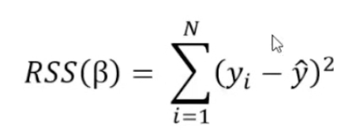
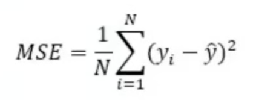
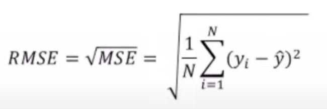
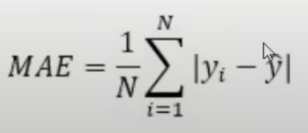

# Supervised Learning

## Regression

### Residual Sum of Squares (RSS)

This is a metric commonly used in the setting of linear regression when we are evaluating the performance of the model in estimating the different coefficients.

- The beta (B) is a coefficient
- *yi* is our dependent variable value
- *y^* is the predicted value

### Mean Squared Error (MSE)

It's the average of the squared differences between the predicted values and the true values.
It's commonly used when you want to penalize large errors more than the small ones. MSE is sensitive to outliers which means it may not be the best choice when the data contains many outliers or extreme values.

- *yi* is our dependent variable value
- *y^* is the predicted value

### Root Mean Squared Error (RMSE)

It's the square root of the MSE.
It's commonly used when you want to compare the performance of different models or when you want to report the error in a way that is easier to understand and to explain.

- MSE is the result of MSE
- *yi* is our dependent variable value
- *y^* is the predicted value

### Mean Absolute Error (MAE)

It's the average absolute difference between the predicted values.
It's commonly used when you want to penalize all errors equally regardless of their magnitude. MAE is less sensitive to outliers compared to RMSE.

- *yi* is our dependent variable value
- *y^* is the predicted value