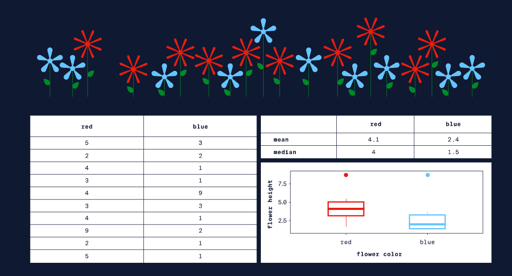
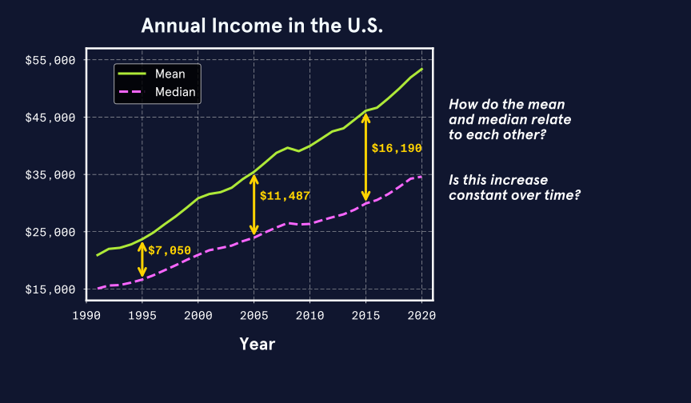
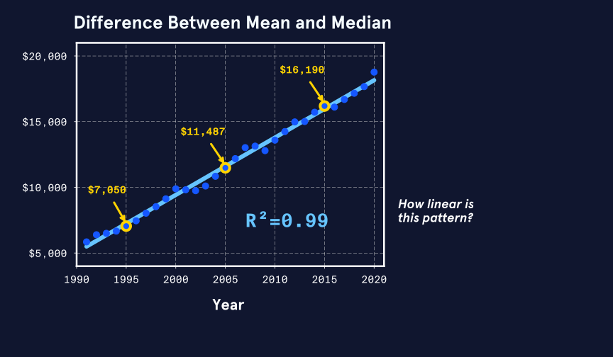
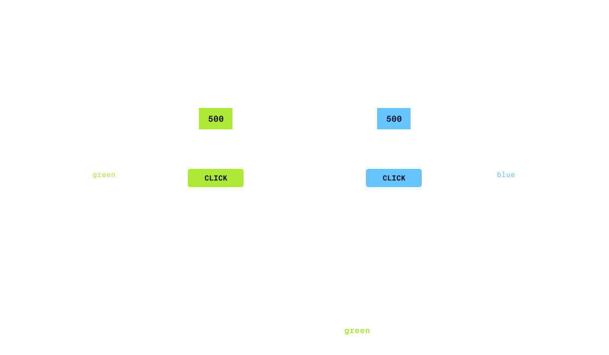
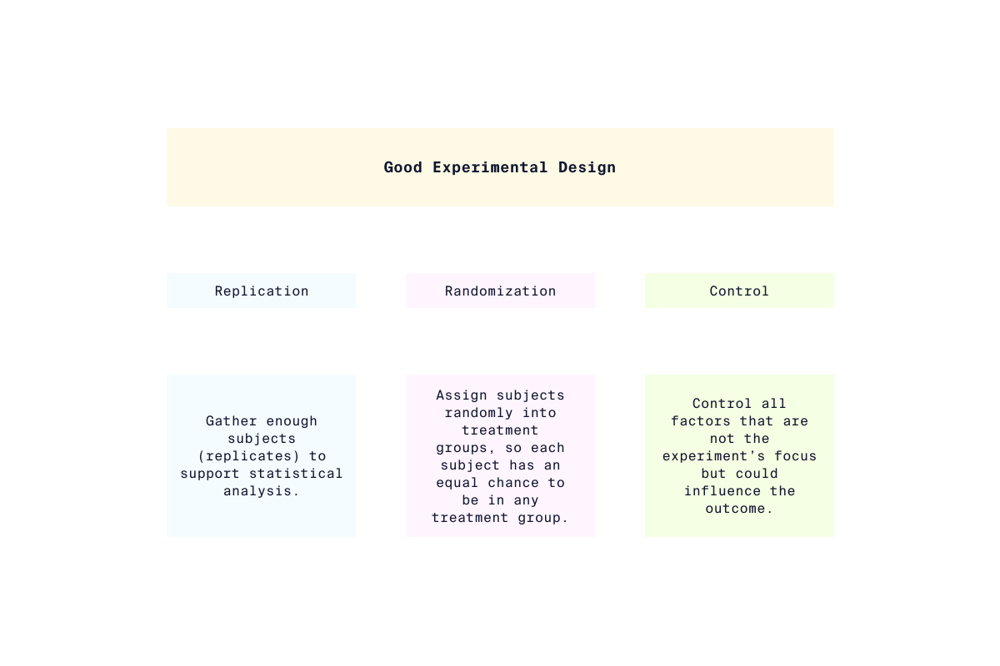
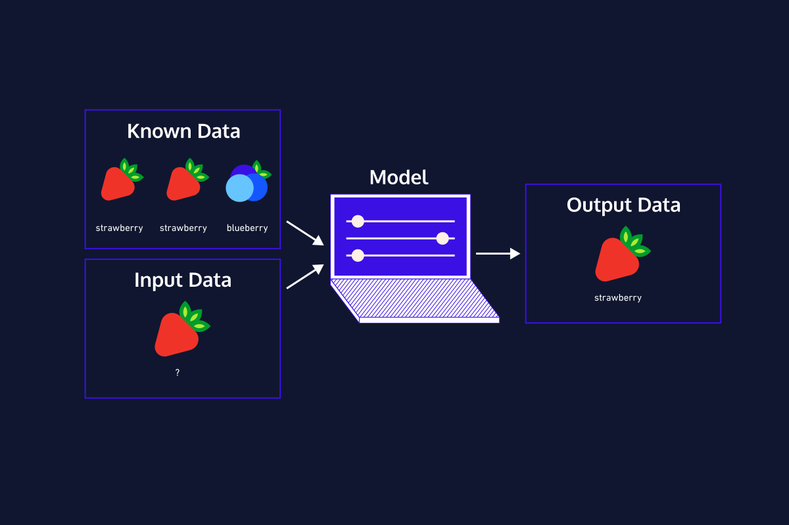

## Introduction

When working with data, our ultimate goal is to draw conclusions. The point of **data analysis** is to discover useful information, inform conclusions, and support deicision-making. In general, data analysis lets us evaluate the presence, strength, and direction of relationships between different variables in our data. It lets us see patterns and make connections that would be impossible to find looking at raw data.  
Importantly, different types of data analysis allow us to draw different types of conclusions. We're gonna focus on **five types of data analysis**:

1. Descriptive analysis
2. Exploratory analysis
3. Inferential analysis
4. Causal analysis
5. Predictive analysis

When applied appropriately, these analysis might let us determine why something happened, why something is the way it is, or what is likely to happen next.

## Descriptive Analysis

Let's imagine we're looking at a field of flowers like the one in the image below. There are flowers with different shapes, colors, and heights. If you had to describe these flowers, how would you quantify all these characteristics? What does a typical blue flower look like? Are blue flowers all similar in height? It's hard to say just looking at a mix of all the flowers, just like it's hard to describe a big dataset just by looking at a spreadsheet of values.  
**Descriptive analysis** lets us describe, summarize, and visualize data so that patterns can emerge. Sometimes we'll only do a descriptive analysis, but most of the time a descriptive analysis is the first step in our analysis process.  
Descriptive analyses induce measures of central tendency (e.g., mean, median, mode) and spread (e.g., range, quartiles, variance, standard deviation, distribution), which are referred to as **descriptives** or **summary statistics**.  
Typically, data visualization is also included in descriptive analysis.  
Descriptive analysis helps us understand our data and decide what steps to take next, but we cannot extend what we learn to other datasets.

  

## Exploratory Analysis

**Exploratory analysis** is the next step after descriptive analysis. With exploratory analysis, we look for relationships between variables in our dataset.  
While our exploratory analyses might uncover some fascinating patterns, we should keep in mind that exploratory analyses cannot tell us *why* something happened: correlation is not the same as causation.  
Let's look at an exploratory analysis with a real dataset! Check out the exploratory plots below. These plots use annual income data for the United States from the government's Social Security Administration Wage Data.  

  

We are exploring trends in annual income over time using two descriptives (mean and median). We see that the difference between these two descriptives seems to be growing. This suggests that annual income in the U.S. is becoming more *skewed*: a few very high earners are pulling the average up.

  

- Next, we plot the difference between mean and median annual income over time. It sure does look like it's increasing with time!
- Finally, we add a trend line and calculate the R-squared, which gives us an indication of how well the line fits the data. With an R-squared of 0.99 out of a maximum of 1.00, we can be very sure that the gap between mean and median is increasing.

Now, consider the following:

1. Can these data tell you *why* the wage gap is increasing in the U.S.?
2. Can you draw conclusions about wages in other countries from these data?

Remember:

- Exploratory analyses show us underlying patterns and relationships *within* datasets.
- Exploratory analyses cannot determine *causation*.

## Inferential Analysis

A/B tests are a popular business tool that data scientists use to optimize websites and other online platforms. A/B tests are a type of **inferential analysis**. Inferential analysis lets us test a hypothesis on a sample of a population and then extend our conclusions to the whole population.  
Imagine we want to know if a blue or green button will get more clicks on a website. We hypothesize that the green button will be more successful and we run an A/B test on a sample of people that visit our site. Half the sample sees the blue button (option A) and half see the green button (option B). At the end of the test, 90% of poeple that saw the green button clicked it, whereas 60% of the people that saw the blue button clicked it.  
Now we need to ask, "If color wasn't related to click rate, how likely was a 30% difference just by chance?" We can use statistics to calculate that probability. If there is less than a 5% probability that our results happened by chance, we have good evidence that green buttons get more clicks!  
We can extend these results to everyone that visits our site (the whole population), so it makes sense to use green buttons on our website.  
This is a powerful thing to be able to do! But since it's so powerful, there are some rules about how to do it:

- Sample size must be big enough compared to the total population size (10% is a good rule-of-thumb).
- Our sample must be randomly selected and representative of the total population.
- We can only test one hypothesis at a time.

  

## Causal Analysis

We know that correlation does not mean causation. This is an important limitation in data analysis. We should be cautious to believe any studies or headlines claiming that one thing caused another without knowing their research methods. However, we often really want to know why something happened. In these cases, we turn to **causal analysis**. Causal analysis generally relies on carefully designed experiments, but we can sometimes also do casual analysis with observational data.  
Experiments that support causal analysis:

- Only change one variable at a time
- Carefully control *all* other variables
- Repeated multiple times with the same results

These are pretty high standards to meet. However, experiments that meet these standards are the clearest way to figure out if one thing caused another.

  

Take a look at the breakdown of good experimental design in the image above and think about the following questions:

1. Could you determine if drinking water caused better sleep by monitoring your own sleep for a month and comparing results from days that you drank 8 glasses of water and days that you did not?
2. Could you determine if drinking more water caused better sleep if you expanded your study to include 1,000 subjects and asked all men to record their sleep on days they drank 8 glasses of water and all women to record their sleep on days that they did not drink 8 glasses of water?

Sometimes we need to establish causation when actual experimentation is impossible. This could be due to a variety of reasons. For example, we might want to know why something happened that we really don't want to repeat (e.g., why did a product flop?), or the necessary experiments may be too difficult, too expensive, or unethical. In such cases, we can sometimes apply causal inference techniques to observational data, but we need to be very careful.  
Causa inference with observational data requires:

- Advanced techniques to identify a causal effect
- Meeting very strict conditions
- Appropriate statistical tests

Let's think about this in terms of climate change. It is important to know if climate change is causing more frequent and intense hurricanes. But, we can't do a controlled, replicated experiment on multiple planets with and without climate change. Instead, climate scientists carefully use causal analysis on observational data to determine whether climate change contributes to bigger hurricanes happening more often.

## Predictive Analysis

We interact with **predictive analysis** in everyday life when we text a friend using text completion or watch a suggested TV show on Netflix. Predictive analysis also underlies computer vision, which is applied in facial recognition software and self-driving cars.  
Predictive analysis uses data and **supervised machine learning** techniques to identify the likelihood of future outcomes.  
Some popular supervised machine learning techniques include **regression models**, **support vector machines**, and **deep learning convolutional neural networks**. The actual algorithm used with each of these techniques is different, but each requires training data. That is, we have to provide a set of already-classified data that the algorithm can "learn" from. Once the algorithm has learned from the features of the training data, it can make predictions about new data.  
An important point here is that the algorithm can only be as good as the data used to train the algorithm. Maybe you've heard the catchphrase, "garbage in, garbage out"? That is certainly true for predictive analysis: a predictive model trained on poor-quality data will make poor-quality predictions.

  

Recommendation algorithms are excellent for making low-risk predictions. When Netflix makes recommendations for you, the predictions are relatively low-risk. For the most part, no one will be hurt if the recommendation is wrong. In contrast, predicting whether someone will commit a crime is a high-risk prediction, especially if the prediction is used for criminal sentencing or deciding to grant someone parole.

## Review

1. Descriptive analysis describes major patterns in data through summary statistics and visualization of measures of central tendency and spread.
2. Exploratory analysis explores relationships between variables within a dataset and can group subsets of data. Exploratory analyses might reveal correlations between variables.
3. Inferential analysis allows us to test hypotheses on a small sample of a population and extend our conclusions to the entire population.
4. Causal analysis lets us go beyond correlation and actually assign causation when we carefully design and conduct experiments. In addition, causal inference sometimes allows us to determine causal effects even when experimentation is not possible.
5. Predictive analysis goes beyond understanding the past and present and allows us to make data-driven predictions about the future. The quality of these predictions is deeply dependent on the quality of the data used to generate predictions.