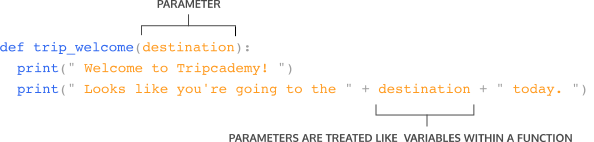
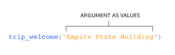

# Introduction

In programming, as we start to write bigger and more complex programs, one thing we will start to notice is we will often have to repeat the same set of steps in many differnet places in our program. <br />
Let's imagine we were building an application to help people plan trips! When using a trip planning application we can say a simple procedure could look like this:

<ol>
  <li>Establish your origin and destination</li>
  <li>Calculate the distance/route</li>
  <li>Return the best route to the user</li>
</ol>

We will perform these three steps every time users have to travel between two points using our trip application. In our programs, we could rewrite the same procedures over and over (and over) for each time we want to travel, but there's a better way! Python gives us a useful concept called *functions*. <br />
Functions are a convenient way to group our code into reusable blocks. A function contains a sequence of steps that can be performed repeatedly throughout a program without having to repeat the process of writing the same code again. <br />
Let's come back to the trip planning application we just discussed previously. If we were to convert our steps into a Python code, a very simple version that plans a trip between two popular New York destinations might look like this:

```py
print("Setting the Empire State Building as the starting point and Times Square as our destination.")
print("Calculating the total distance between our points.")
print("The best route is by train and will take approximately 10 minutes.")
```

Anytime we want to go between these two points we would need to run these three print statements (for now we can assume the best route and time will stay the same). <br />
If our program now had 100 people trying to find the best directions between the Empire State Building and Times Square, we would need to run each of our three print statements 100 times! <br />
Now, if you're thinking about using a loop here, your intuition would be totally right! Unfortunately, we won't be always traveling between the same two locations which means a loop won't be as effective when we want to customize a trip. We will address this later.

## Defining a Function

A function consists of many parts, so let's first get familiar with its core - a function definition. <br />
Here's an example of a function definition:

```py
def function_name():
  # functions tasks go here
```

There are some key components we want to note here:


<ul>
  <li>The <code>def</code> keyword indicates the beginning of a function (also known as a function header). The function header is followed by a name in snake_case format that describes the task the function performs. It's best practice to give your functions a descriptive yet consise name.</li>
  <li>Following the function name is a pair of parenthesis <code>()</code> that can hold input values known as parameters (more on parameters later). In this example function, we have no parameters.</li>
  <li>A colon <code>:</code> to mark the end of the function header.</li>
  <li>Lastly, we have one or more valid python statements that make up the function body (where we have our python comment).</li>
</ul>

Notice we've indented our `# function tasks go here` comment. Like loops and conditionals, code inside a function must be indented to show that they are part of the function. <br />
Here is an example of a function that greets a user for our trip planning application:

```py
def trip_welcome():
  print("Welcome to Tripcademy!")
  print("Let's get you to your destination.")
```

**Note**: Running this code will result in an empty terminal. The `print()` statements within the function will not execute since our function hasn't been used. We will explore this further.

## Calling a function

The process of executing the code inside the body of a function is known as calling it (This is also known as "executing a function"). To call a function in Python, type out its name followed by parentheses `()`. <br />
Let's revisit our `directions_to_timesSq()` function:

```py
def directions_to_timesSq():
  print("Walk 4 mins to 34th St Herald Square train station.")
  print("Take the Northbound N, Q, R, or W train 1 stop.")
  print("Get off the Times Square 42nd Street stop.")
```

To call our function, we must type out the function's name followed by a pair of parentheses and no indentation:

```py
directions_to_timesSq()
```

Calling the function will execute the `print` statements within the body (from the top statement to the bottom statement) and result in the following output:

```
Walk 4 mins to 34th St Herald Square train station.
Take the Northbound N, Q, R, or W train 1 stop.
Get off the Times Square 42nd Street stop.
```

Note that you can only call a function *after* it has been defined in your code.

## Whitespace & Execution Flow

Consider our welcome function for our trip planning application:

```py
def trip_welcome():
  print("Welcome to Tripcademy!") 
  print("Let's get you to your destination.")
```

The print statements all run together when `trip_welcome()` is called. This is because they have the same base level of indentation (2 spaces). <br />
In Python, the amount of whitespace tells the computer what is part of a function and what is not part of that function. <br />
If we wanted to write another statement outside of `trip_welcome()`, we would have to unindent the new line:

```py
def trip_welcome():
  # Indented code is part of the function body
  print("Welcome to Tripcademy!") 
  print("Let's get you to your destination.")

# Unindented code below is not part of the function body
print("Woah, look at the weather outside! Don't walk, take the train!")

trip_welcome()
```

Our `trip_welcome()` function steps will not print `Whoah, look at the weather outside! Don't walk, take the train!` on our function call. The `print()` statement was unindented to show it was not a part of the function body but rather a separate statement. <br />
We would see the following output from this program:

```
Woah, look at the weather outside! Don't walk, take the train!
Welcome to Tripcademy!
Let's get you to your destination.
```

Lastly, note that the execution of a program always begins on the first line. The code is then executed one line at a time from top to bottom. This is known as *execution flow* and is the order a program in python executes code. <br />
`Woah, look at the weather outside! Don't walk, take the train!` was printed before the `print()` statements from the function `trip_welcome()`. <br />
Even though our function was defined before our lone `print()` statement, we didn't call our function until after.

## Parameters and Arguments

Our function does a really good job of welcoming anyone who is traveling to Times Square but a really poor job if they are going anywhere else. In order for us to make our function a bit more dynamic, we are going to use the concept of function **parameters**. <br />
Function parameters allow our function to accept data as an input value. We list the parameters a function takes as input between the parentheses of a function `()`. <br/>
Here's a function that defines a single parameter:

```py
def my_function(single_parameter):
```

In the context of our `trip_welcome()` function, it would look like this:

```py
def trip_welcome(destination):
  print("Welcome to Tripcademy!") 
  print("Looks like you're going to " + destination + " today.")
```

In the above example, we define a single parameter called `destination` and apply it in our function body in the second `print` statemenet. We are telling our function it should expect some data passed in for destination that it can apply to any statements in the function body. <br />
But how do we actually use this parameter? Our parameter of `destination` is used by passing an *argument* to the function when we call it.

```py
trip_welcome("Times Square")
```

This would output:

```
Welcome to Tripcademy!
Looks like you're going to Times Square today. 
```

To summarize, here is a quick breakdown of the distinct between a parameter and an argument:

<ol>
  <li>
    The parameter is the name defined in the parenthesis of the function and can be used in the function body.
    <div style="margin-bottom:32px">
      
    </div>
  </li>

  <li>
    The argument is the data that is passed in when we call the function, which is then assigned to the parameter name.
    <div style="margin-bottom:32px">
      
    </div>
  </li>
</ol>

## Multiple Arguments

Using a single parameter is useful but functions let us use as many parameters as we want! That way, we can pass in more than one input to our functions. <br />
We can write function that takes in more than one parameter by using commas:

```py
def my_function(parameter1, parameter2, paramter3):  
  # Some code
```

When we call our function, we will need to provide arguments for each of the parameters we assigned in our function definition.

```py
# Calling my_function
my_function(argument1, argument2)
```

For example, take our trip application's `trip_welcome()` function that has two parameters:

```py
def trip_welcome(origin, destination):
  print("Welcome to Tripcademy")
  print("Looks like you are traveling from " + origin)
  print("And you are heading to " + destination)
```

Our two parameters in this function are `origin` and `destination`. In order to properly call our function, we need to pass argument values for both of them. <br />
The ordering of your parameters is important as their position will map to the position of the arguments and will determine their assigned value in the function body. <br />
Our function call could look like:

```py
trip_welcome("Prospect Park", "Atlantic Terminal")
```

In this call, the argument value of `"Prospect Park"` is assigned to be the `origin` parameter, and the argument value of `"Atlantic Terminal"` is assigned to the `destination` parameter. <br />
The output would be:

```
Welcome to Tripcademy
Looks like you are traveling from Prospect Park
And you are heading to Atlantic Terminal
```

## Types of Arguments

In Python, there are 3 different types of arguments we can give a function. <br />

<ul>
  <li>Positional arguments: arguments that can be called by their position in the function definition.</li>
  <li>Keyword arguments: arguments that can be called by their name.</li>
  <li>Default arguments: arguments that are given default values.</li>>
</ul>

Positional arguments are arguments we have already been using! Their assignments depend on their positions in the function call. Let's look at a function called `calculate_taxi_price()` that allows our users to see how much a taxi would cost to their destination.

```py
def calculate_taxi_price(miles_to_travel, rate, discount):
  print(miles_to_travel * rate - discount )
```

In this function, `miles_to_travel` is *positioned* as the first parameter, `rate` is positioned as the second parameter, and `discount` is the third. When we call our function, the position of the arguments will be mapped to the positions defined in the function declaration.

```py
# 100 is miles_to_travel
# 10 is rate
# 5 is discount
calculate_taxi_price(100, 10, 5)
```

Alternatively, we can use *keyword arguments* where we explicitly refer to what each argument is assigned to in the function call. Notice in the code example below that the arguments do not follow the same order as defined in the function declaration.

```py
calculate_taxi_price(rate=0.5, discount=10, miles_to_travel=100)
```

Lastly, sometimes we want to give our function parameters default values. We can provide a default value to a parameter by using the assignment operator (=). This will happen in the function declaration rather than the function call. <br />
Here is an example where the discount argument in our `calculate_taxi_price` function will always have a default value of 10:

```py
def calculate_taxi_price(miles_to_travel, rate, discount = 10):
  print(miles_to_travel * rate - discount)
```

When using a default argument, we can either choose to call the function without providing a value for a discount (and thus our function will use the default value assigned) or overwrite the default argument by providing our own:

```py
# Using the default value of 10 for discount.
calculate_taxi_price(10, 0.5)

# Overwriting the default value of 10 with 20
calculate_taxi_price(10, 0.5, 20)
```

## Built-in Functions vs User Defined Functions

There are two distinct categories for functions in the world of Python. What we have been writing so far are called *User Defined Functions* - functions that are written by users. <br />
There is another category called *Built-in Functions* - functions that come built into Python for us to use. Both `print` and `str` that we have been using are built into the language for us. <br />
There are lots of different built-in functions that we can use in our programs. Take a look at this example of using `len()` to get the length of a string:

```py
destination_name = "Venkatanarasimharajuvaripeta"

# Built-in function: len()
length_of_destination = len(destination_name)

# Built-in function: print()
print(length_of_destination)
```

Would output the value of `length_of_destination`:

```
28
```

Here we are using a total of two built-in functions in our example: `print()` and `len()`.

## Variable Access

As we expand our programs with more functions, we might start to ponder, where exactly do we have access to our variables? To examine this, let's revisit a modified version of the first function we built out:

```py
def trip_welcome(destination):
  print(" Looks like you're going to the " + destination + " today. ")
```

What if we wanted to access the variable `destination` outside of the function? Could we use it?

```py
def trip_welcome(destination):
  print(" Looks like you're going to the " + destination + " today. ")

print(destination)
```

```
NameError: name 'destination' is not defined
```

If we try to run this code, we will get a NameError, telling us that `destination` is not defined. The variable `destination` has only been defined inside the space of a function, so it does not exist outside the function. <br />
We call the part of a program where `destination` can be accessed its *scope*. The scope of `destination` is only inside the `trip_welcome()`. <br />
Take a look at another example:

```py
budget = 1000

# Here we are using a default value for our parameter of `destination` 
def trip_welcome(destination="California"):
    print(" Looks like you're going to " + destination)
    print(" Your budget for this trip is " + str(budget))

print(budget)
trip_welcome()
```

Our output would be:

```
1000
Looks like you're going to California 
Your budget for this trip is 1000
```

Here we are able to access the `budget` both inside the `trip_welcome` function as well as our `print()` statement. If a variable lives outside of any function it can be accessed anywhere in the file.

## Returns

At this point, our functions have been using `print()` to help us visualize the output in our interpreter. Functions can also *return* a value to the program so that this value can be modified or used later. We use the Python keyword `return` to do this. <br />
Here's an example of a program that will `return` a converted currency for a given location a user may want to visit in our trip planner application.

```py
def calculate_exchange_usd(us_dollars, exchange_rate):
  return us_dollars * exchange_rate

new_zealand_exchange = calculate_exchange_usd(100, 1.4)

print("100 dollars in US currency would give you " + str(new_zealand_exchange) + " New Zealand dollars")
```

This would output:

```
100 dollars in US currency would give you 140 New Zealand dollars
```

Saving our values returned from a function like we did with `new_zealand_exchange` allows us to reuse the value (in the form of a variable) throughout the rest of the program. <br />
When there is a result from a function that is stored in a variable, it is called a *returned function value*.

## Multiple Returns

Sometimes we may want to return more than one value from a function. We can return several values by separating them with a comma. Take a look at this example of a function that allows users in our travel application to check the upcoming week's weather (starting on Monday):

```py
weather_data = ['Sunny', 'Sunny', 'Cloudy', 'Raining', 'Snowing']

def threeday_weather_report(weather):
  first_day = " Tomorrow the weather will be " + weather[0]
  second_day = " The following day it will be " + weather[1]
  third_day = " Two days from now it will be " + weather[2]

  return first_day, second_day, third_day
```

This function takes in a set of data in the form of a list for the upcoming week's weather. We can get our returned function values by assigning them to variables when we call the function:

```py
monday, tuesday, wednesday = threeday_weather_report(weather_data)

print(monday)
print(tuesday)
print(wednesday)
```

This will print:

```
Tomorrow the weather will be Sunny
The following day it will be Sunny
Two days from now it will be Cloudy
```