# Introduction

Jupyter Notebook (sometimes called IPython Notebook) is a popular way to write and run Python code, especially for data analysis, data science and machine learning. Jupyter Notebooks are easy-to-use because they let you execute code and review the output quickly. This iterative process is central to data analytics and makes it easy to test hypotheses and record the results (just like a notebook). <br />
For example, let's say you are visualizing a dataset about life expectancy by country. You only want to show some countries, but you are not sure which ones to select. With a Jupyter Notebook, you can try multiple versions and easily compare. Even better, you have a written record of what you've already tried that you can show to a teammate (or your future self).

<div style="margin-bottom:32px">
  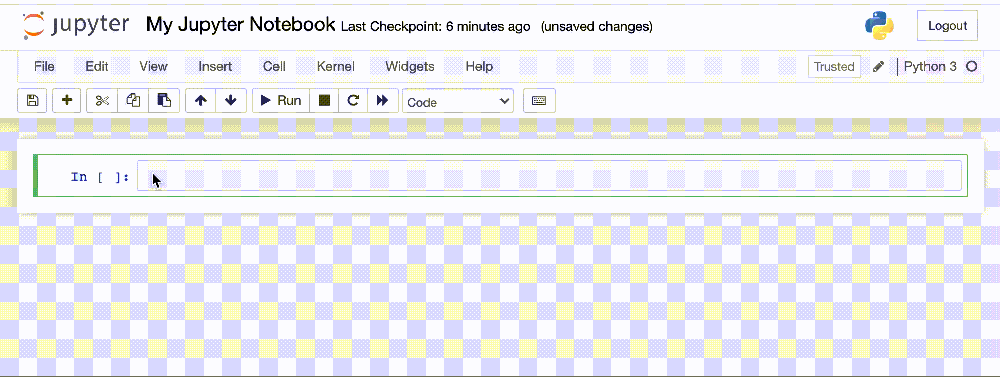
</div>

Above is the Jupyter Notebook interface. A Jupyter Notebook has two parts:

<ul>
  <li>the front-end interface (what you see in the gif)</li>
  <li>the back-end kernel</li>
</ul>

The front-end interface loads in a web browser and consists of "cells" where you enter your code. The browser is just for display, so you do not need to be connected to the internet. <br />
Jupyer Notebook uses a back-end kernel called IPython. The "I" stands for "Interactive", which means that a program or script can be broken up into smaller pieces, and those pieces can be run independently from the rest of the program.

## Installation

It's recommended to install Jupyter Notebook as part of either **Anaconda** or as an addition to **Miniconda**. Jupyter Notebook can be installed separately, but having either Anaconda or Miniconda already installed makes installing Jupyter Notebook easier. <br />
Anaconda is a Python and R distribution that comes with all the tools you need to start working with data, including packages, development environments, and more. However, it requires a lot of memory (3 GB). Miniconda is a "minimal" version of Anaconda that requires less memory (about 50 MB) but does not come with any packages or environments pre-installed. <br />
Both Anaconda and Miniconda come with **Conda**. Conda is a package manager. Package managers help with installing, updating, and removing packages. **Pip** is another popular package manager, and we will use both. The difference between conda and pip is that conda manages packages and environments in any language (including Python), whereas pip only manages Python packages. <br />
We will use pip to manage Python packages since it is the method recommended by the Python Packaging Authority. Conda's role in our workflow is to manager Jupyter Notebook. <br />
If you have 3 GB of space on your computer and want the most straightforward installation, install Anaconda.
If you do not have 3 GB of space available or you want to save space and don't mind doing some manual work, install Miniconda.

### Installing Jupyter Notebook using Anaconda on Windows

You will need to know what System type (number of bits) you have before downloading the package. If you are unsure, let's check! <br />

**On Windows 10 and Windows 8.1**:

<ol>
  <li>Select the Start button, then select Settings > System > About</li>
  <li>At the right, under Device specifications, see System type</li>
</ol>

**On Windows 7**:

<ol>
  <li>Select the Start button, right-click Computer, and then select Properties</li>
  <li>Under System, see the System type</li>
</ol>

<div style="margin-bottom:32px">
  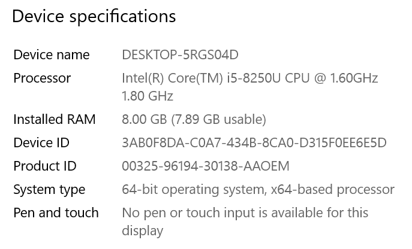
</div>

Go to the [Anaconda Downloads page](https://www.anaconda.com/products/individual#Downloads) and download the appropriate version of Anaconda (32- or 64-bit Graphical Installer):

<ol>
  <li>Double click on the .exe file and click <code>Install</code></li>
  <li>Read and agree to the licensing terms</li>
  <li>Select if you want to install for "Just me" or "All Users". If you are installing for "All Users", you must have Administrator privileges</li>
  <li>You will be prompted to select the installation location. By default, Anaconda should try to install in your home directory. We reocommend accepting this default. Click <code>Install</code></li>
  <li>You will be asked if you want to add Anaconda to your PATH environment variable. Do not add Anaconda to the PATH because it can interfere with other software</li>
  <li>You will be asked if you want Anaconda to be your default version of Python. We recommend "Yes". There are some rare instances where you might not make Anaconda the default version, but they are beyond the scope of this tutorial</li>
  <li>Click the <code>Install</code> button</li>
  <li>Go ahead and finish the installation</li>
</ol>

Now you can verify your installation. Go to the Windows Start menu and search for "Anaconda Navigator" (not the Anaconda Prompt).

<div style="margin-bottom:32px">
  
</div>

Double-click on it, and the Anaconda Navigator window should appear.

<div style="margin-bottom:32px">
  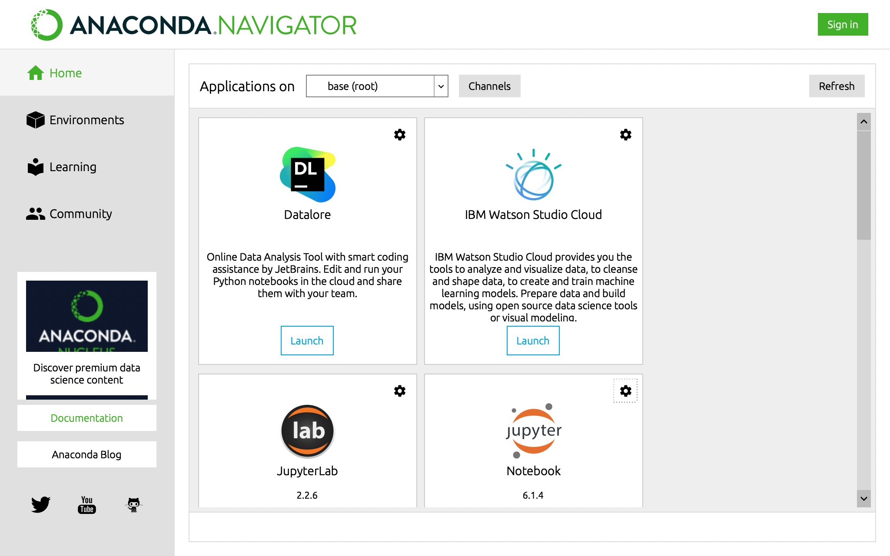
</div>

Your application screen may look slightly different from this one, but that is ok. Click the `Launch` button under Jupyter Notebook. A Jupyter Notebook interface will appear in your default browser.

<div style="margin-bottom:32px">
  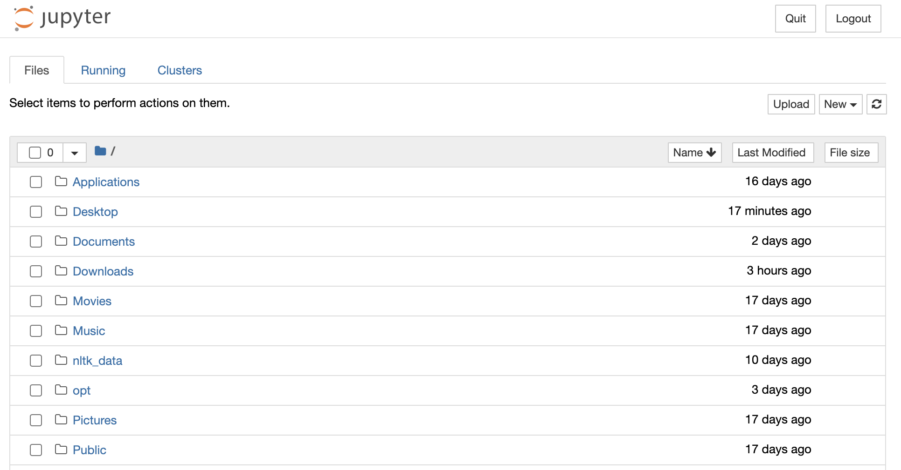
</div>

An Anaconda Prompt might also open and display a URL. If it does, do not close it until you are done working with Jupyter Notebook. If it does not appear, don't worry - this has to do with your operating system and will not affect Jupyter Notebook's performance.

### Installing Jupyter Notebook using Miniconda on Windows

Go to the [Miniconda Downloads page](https://www.anaconda.com/docs/getting-started/miniconda/main#windows-installers). Download the appropriate (32- or 64-bit) Python 3.X version of Miniconda. <br />

<ol>
  <li>Double click on the .exe file and click <code>Install</code></li>
  <li>Read and agree to the licensing terms</li>
  <li>Select if you want to install for "Just me" or "All Users". If you are installing for "All Users", you must have Administrator privileges</li>
  <li>You will be prompted to select the installation location. By default, Miniconda should try to install in your home directory. We reocommend accepting this default. Click <code>Install</code></li>
  <li>You will be asked if you want to add Miniconda to your PATH environment variable. Do not add Miniconda to the PATH because it can interfere with other software</li>
  <li>You will be asked if you want Miniconda to be your default version of Python. We recommend "Yes". There are some rare instances where you might not make Miniconda the default version, but they are beyond the scope of this tutorial</li>
  <li>Click the <code>Install</code> button</li>
</ol>

First, let's verify that Miniconda was installed. We will use the Anaconda Prompt (miniconda3). Go to the Start Menu and search for the Anaconda Prompt. Anaconda Prompt is the Command Line Interface (CLI) we will use with Miniconda. In the shell, type:

```
conda --version
```

<div style="margin-bottom:32px">
  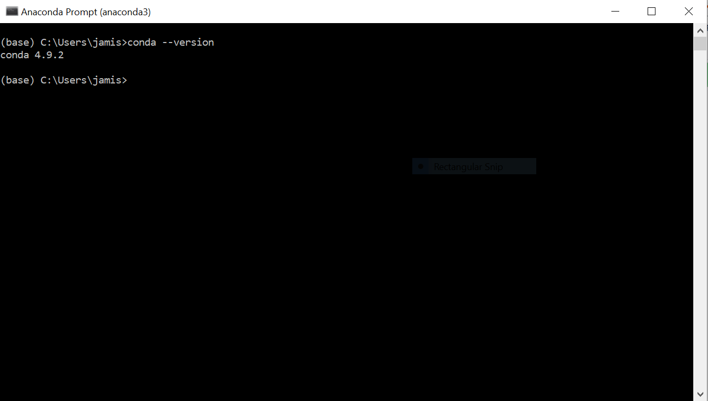
</div>

A number should be returned. This is the version number of conda that you have installed. <br />
Now, we need to install a few key packages. In the Anaconda Prompt, type:

```
conda install jupyter
```

When prompted with "Proceed ([y]/n)?", type `y` and press Enter.

<div style="margin-bottom:32px">
  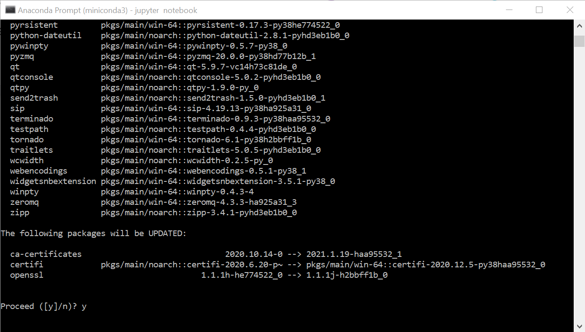
</div>

Once the installation completes, in the Anaconda Prompt type:

```
jupyter notebook
```

A Jupyter Notebook interface will appear in your default browser. <br />
An Anaconda Prompt might also open and display a URL. If it does, do not close it until you are done working with Jupyter Notebook. If it does not appear, don't worry - this has to do with your operating system and will not affect Jupyter Notebook's performance.

<div style="margin-bottom:32px">
  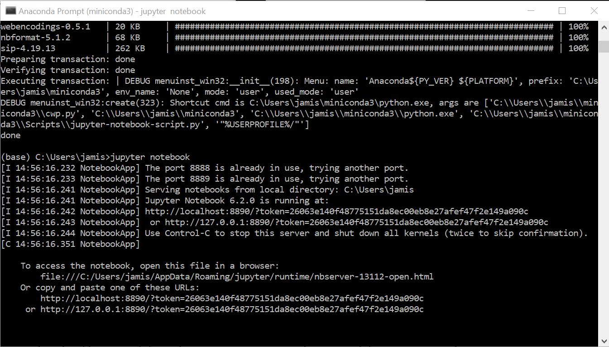
</div>

Let's install a few packages to get you started working with data in Jupyter Notebook. These are all Python packages, so we will use *pip* instead of *conda* to install them. <br />
We will load:

<ul>
  <li><strong>pandas</strong> for working with DataFrames</li>
  <li><strong>scikit-learn</strong> for machine learning</li>
  <li><strong>Matplotlib</strong> for visualizations</li>
  <li><strong>seaborn</strong> for statistical visualizations</li>
  <li><strong>NLTK</strong> for text analysis</li>
  <li><strong>spaCy</strong> for more text analysis</li>
</ul>

Note that some of these packages depend on other packages. For example, scikit-learn requires **NumPy** (among others). Package managers (like pip) automatically find all the dependencies and install them for you. So when you install scikit-learn, pip automatically installs NumPy and any other dependencies scikit-learn needs. <br />
Opean a new Anaconda Prompt and type the following commands (hit "Enter" after each row):

```
pip install pandas
pip install scikit-learn
pip install matplotlib
pip install seaborn
pip install nltk
pip install beautifulsoup4
```

You can check to be sure these are all installed by starting Python in your Anaconda Prompt. <br />
On a new line, type `python`. The header will change to be `>>>`:

<div style="margin-bottom:32px">
  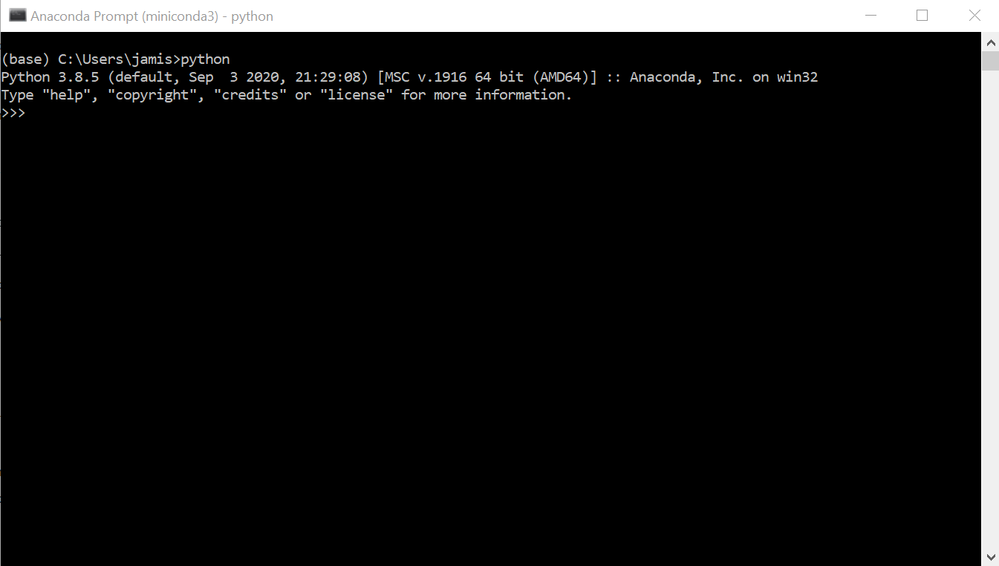
</div>

You can import each package on a separate line or take a shortcut and import them all at once. Type:

```
import pandas
import sklearn
import matplotlib
import seaborn
import nltk
import bs4
```

Or:

```
import pandas, sklearn, matplotlib, seaborn, nltk, bs4
```

<div style="margin-bottom:32px">
  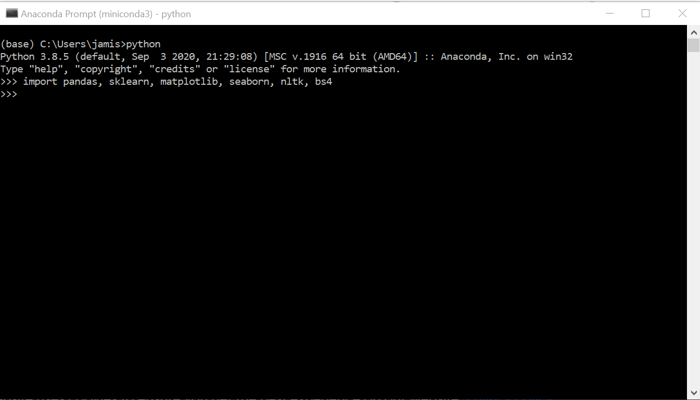
</div>

If nothing happens, everything is installed perfectly.
What if it didn't work? You will probably get this error message:

```
ModuleNotFoundError: No module named MODULE
```

**Note**: "packages", "modules", and "libraries" all refer to the same thing.

<div style="margin-bottom:32px">
  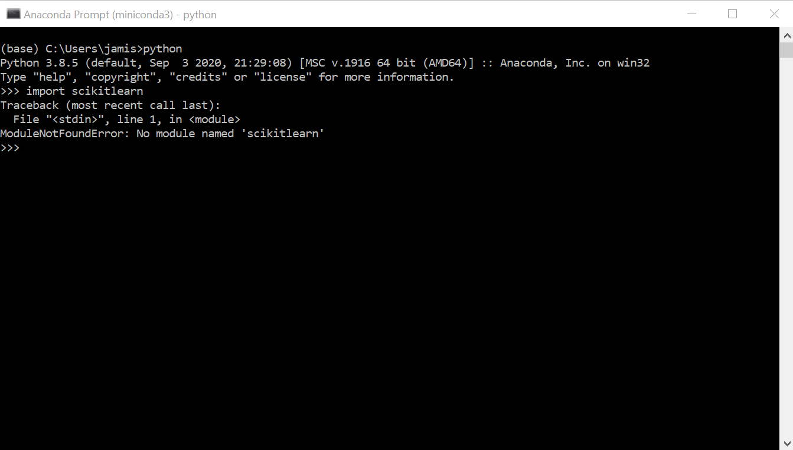
</div>

### Installing Jupyter Notebook using Anaconda on Mac

You will need to have access to your BASH or zsh Terminal. <br />
Go to the [Anaconda Downloads page](https://www.anaconda.com/products/individual#Downloads) and download the 64-bit Graphical Installer for Mac. <br />

<ol>
  <li>Double click on the .pkg file and click <code>Install</code></li>
  <li>Read and agree to the licensing terms</li>
  <li>Select if you want to install for "Just me" or "All Users". If you are installing for "All Users", you must have Administrator privileges</li>
  <li>You will be prompted to select the installation location. By default, Anaconda should try to install in your home directory. We recommend accepting this default. Click <code>Install</code></li>
  <li>You will be asked if you want to add Anaconda to your PATH environment variable. Do not add Anaconda to the PATH because it can interfere with other software</li>
  <li>You will be asked if you want Anaconda to be your default version of Python. We recommend "Yes". There are some rare instances where you might not make Anaconda the default version, but they are beyond the scope of this tutorial</li>
  <li>Click the <code>Install</code> button</li>
  <li>You may be asked if you want to install PyCharm. PyCharm is another IDE (similar to Jupyter Notebook), but it is not necessary right now</li>
  <li>Go ahead and finish the installation</li>
</ol>

Now, you can verify your installation. Go to your Applications folder and double-click on Anaconda Navigator.

<div style="margin-bottom:32px">
  
</div>

If the shortcut doesn't appear (since Anaconda isn't a regular program, it may appear differently depending on your operating system), click `Command` + `Shift` and search for "Anaconda Navigator". If you have to do this, we recommend manually creating a shortcut to your Applications, Desktop, or any other folder you find convenient. <br />
Double click on it, and the Anaconda Navigator window should appear.

<div style="margin-bottom:32px">
  
</div>

Your applications screen may look slightly different from this one, but that is ok. Click the `Launch` button under Jupyter Notebook. A Jupyter Notebook interface will appear in your default browser. <br />
You may also notice that an Anaconda Prompt also opened. This needs to stay open while you are working in Jupyter Notebook.

<div style="margin-bottom:32px">
  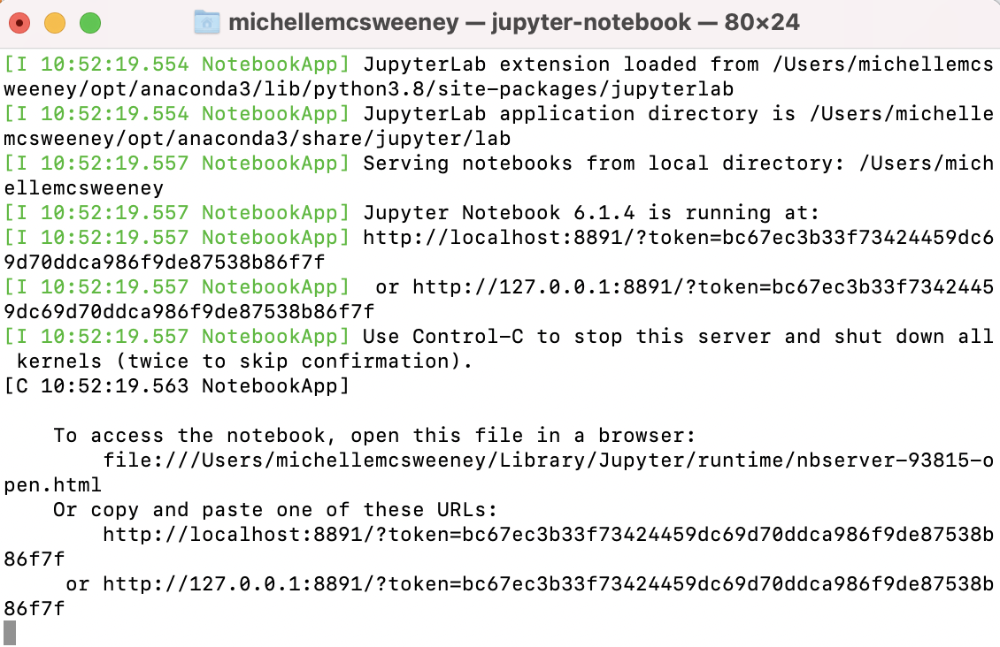
</div>

### Installing Jupyter Notebook using Miniconda on Mac

Go to the [Miniconda Downloads page](https://docs.conda.io/en/latest/miniconda.html). Download the Miniconda3 MacOSX 64-bit pkg. <br />

<ol>
  <li>Double click on the .pkg file and click <code>Continue</code></li>
  <li>Read and agree to the licensing terms</li>
  <li>Select if you want to install for "Just me" or "All Users". If you are installing for "All Users", you must have Administrator privileges</li>
  <li>You will be prompted to select the installation location. By default, Miniconda should try to install in your home directory. We recommend accepting this default. Click <code>Install</code></li>
  <li>You will be asked if you want to add Miniconda to your PATH environment variable. Do not add Miniconda to the PATH because it can interfere with other software</li>
  <li>Click the <code>Install</code> button</li>
</ol>

First, let's verify that Miniconda was installed. Open a BASH or zsh terminal and type:

```
conda --version
```

A number should be returned. This is the version number of conda that you have installed.

<div style="margin-bottom:32px">
  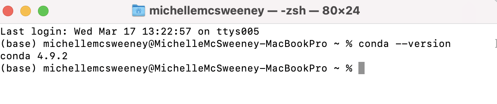
</div>

Now we need to install a few packages. In the BASH or zsh terminal, type:

```
conda install jupyter
```

When prompted with "Proceed ([y]/n)?", type `y` and press Enter.

<div style="margin-bottom:32px">
  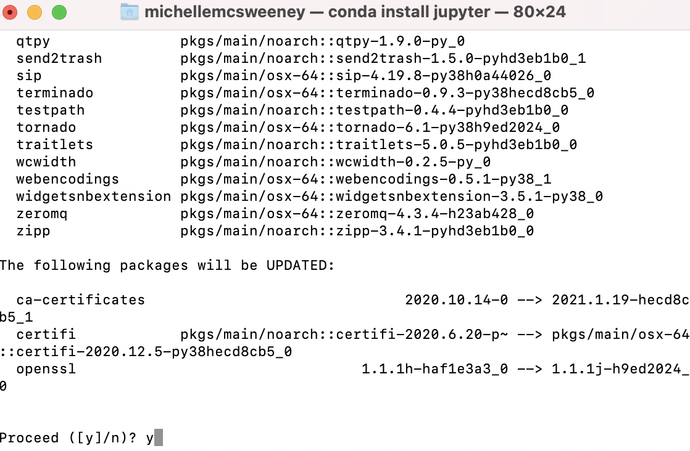
</div>

Once the installation completes, in the BASH or zsh terminal, type:

```
jupyter notebook
```

A Jupyter Notebook interface will appear in your default browser. <br />
You may also notice that the BASH or zsh terminal is now displaying a url. This needs to stay open while you are working in Jupyter Notebook. <br />
Install additional packages:

```
pip install pandas
pip install sklearn
pip install matplotlib
pip install seaborn
pip install nltk
pip install beautifulsoup4
```

## Writing and Debugging Code in Jupyter

There are multiple ways to open a Jupyter Notebook. If you have Anaconda, you can continue to launch from the Navigator like we did when we installed Jupyter Notebook. <br />
If you have Miniconda or just want to use the Command Line, open the BASH/zsh Shell (Mac) or Anaconda Prompt (Windows) and launch a Jupyter Notebook with the command:

```
jupyter notebook
```

A Jupyter Notebook interface will appear in your default browser.

<div style="margin-bottom:32px">
  
</div>

When the notebook starts, you will see a list of all folders your program will have access to. <br />
You can open a new Python file by selecting `New` >> `Python3`.

<div style="margin-bottom:32px">
  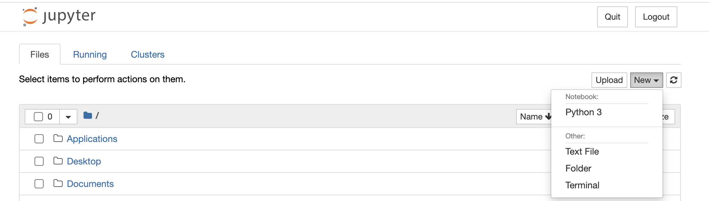
</div>

The new notebook will open in a new tab. Click on the title ro rename it.

<div style="margin-bottom:32px">
  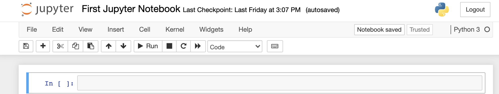
</div>

This is where you will write your code. You can write small or large chunks of code in each cell and run each cell independently of others. <br />
To run a cell, you can use the `Run` button or `Shift` + `Enter`.

<div style="margin-bottom:32px">
  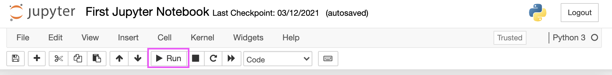
</div>

A new cell will appear after you run the cell you are working in. You can also add a new cell by clicking the `+` button at the top.

<div style="margin-bottom:32px">
  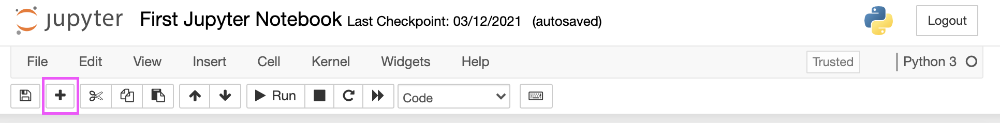
</div>

Now we'll go through some examples of how to write code in Jupyter Notebook. <br />
When you write code in Jupyter Notebook, you will need to run each cell individually. Start with a basic print statement: `print("hello world")`. <br />
Notice that the result is printed below the cell.

<div style="margin-bottom:32px">
  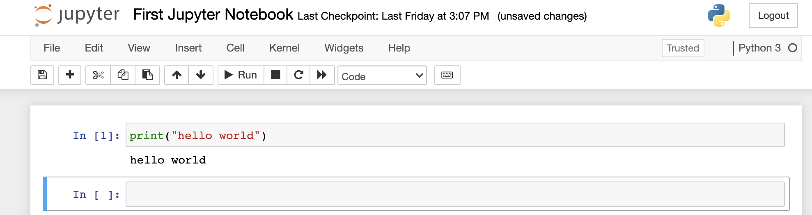
</div>

Let's try another one. This time, we will assign variables `x = 2` and `y = 3`. When we run this cell, nothing appears in the output.

<div style="margin-bottom:32px">
  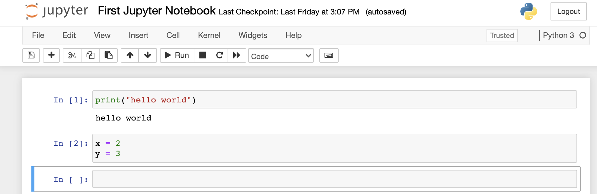
</div>

Assigning variables doesn't generate any output, so there is no result to write. We know the cell has finished running because a number appeared in the `[]` (this is a temporary cell number). Let's try using our `x` and `y` variables. We can add them together. <br />
Enter `x + y` in the next cell.

<div style="margin-bottom:32px">
  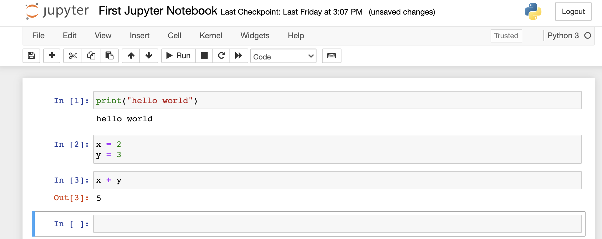
</div>

Notice that we didn't use a `print()` statement, but Jupyter Notebook wrote the result anyhow. <br />
Jupyter Notebook will only write the result of the last line but will print anything contained in a print statement no matter where it occurs. This can be confusing at first, so let's look at an example. In the next cell, enter:

```py
x + y
x - y
```

<div style="margin-bottom:32px">
  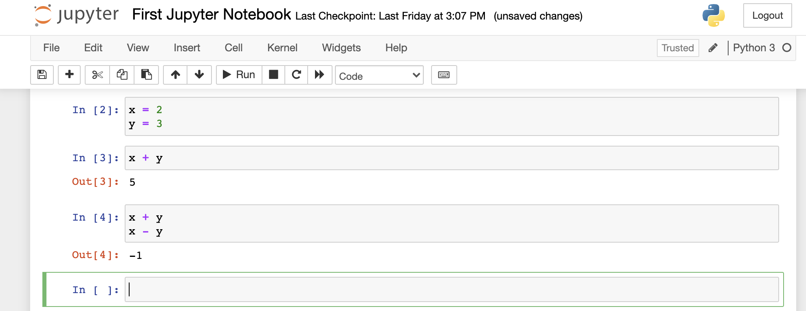
</div>

This time only `-1` was returned. This is because Jupyter Notebook only displays the last line. If you want to display both, you have to wrap the first one in a `print()` statement.

```py
print(x + y)
x - y
```

<div style="margin-bottom:32px">
  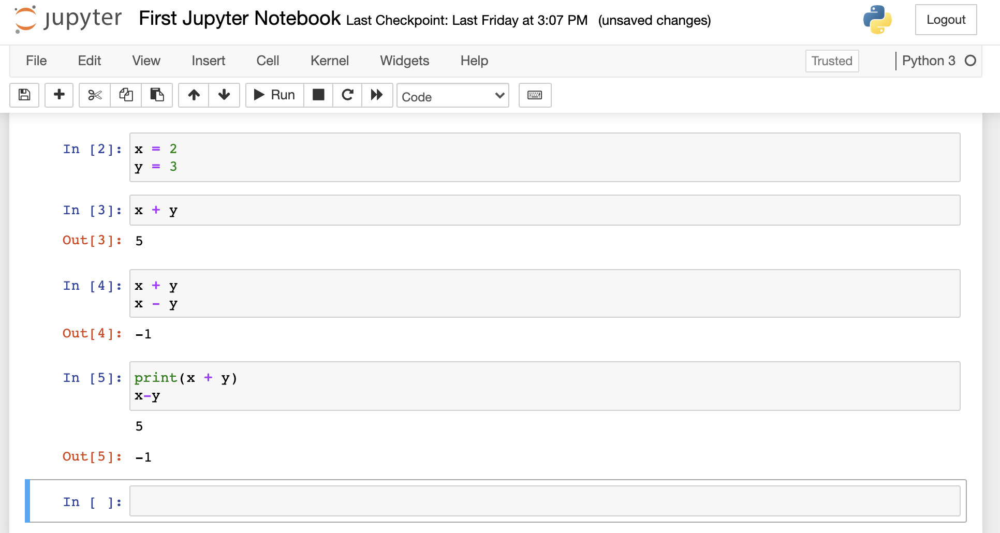
</div>

Let's work with some data. We have a list of numbers: `mynums = [1, 2, 3, 4, 5]`. <br />
Input this list into a cell and return the output.

```py
mynums = [1, 2, 3, 4, 5]
mynums
```

<div style="margin-bottom:32px">
  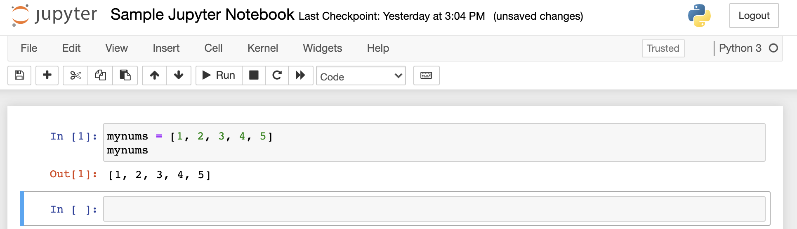
</div>

Now let's try printing each item to the console.

```py
for n in mynums:
  print(n+1)
```

<div style="margin-bottom:32px">
  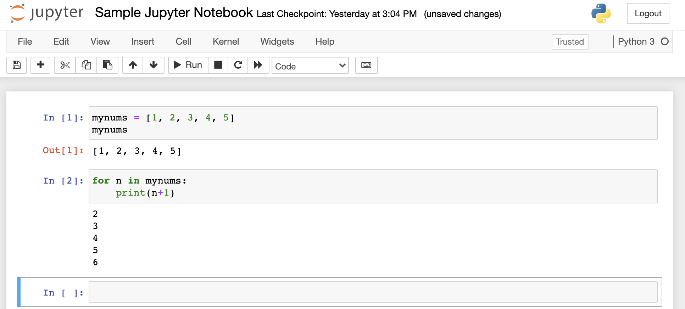
</div>

## Helpful Features

Jupyter Notebook has a generalized help function with the `?` character. Let's say you want to know what object type `mynums` is. You can use the `?` to get full documentation about it.

```
mynums?
```

<div style="margin-bottom:32px">
  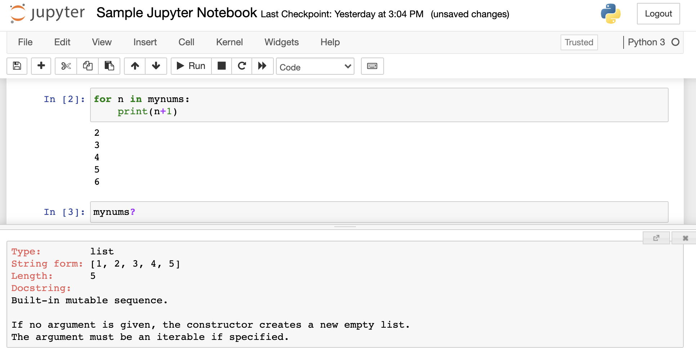
</div>

Here you can see the object type, a preview of the data, and general information. You can do the same for functions such as `len` or `sum`. <br />
Jupyter Notebook also offers tab completion. Tab completion means that you can start typing, hit the `Tab` key, and Jupyter Notebook will offer suggestions about what could come next. For example, to turn our list into a pandas DataFrame, we can use the `.DataFrame()` function. But you might forget how it is spelled. The tab function to the rescue! <br />
First, import pandas.

```py
import pandas as pd
```

Then type `D` and hit the `Tab` button to see your options.

```
pd.D
```

<div style="margin-bottom:32px">
  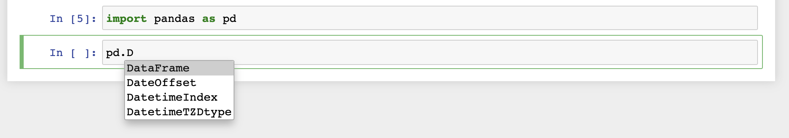
</div>

You can keep typing or select `DataFrame` from the list. <br />
Sometimes, you might know the function's name but forget what arguments it needs. <br />
Fortunately, Jupyter Notebook has a solution for that too. Fir example, you want to sort your list from largest to smallest. You know you need the `.sort()` function, but you forgot what arguments you need to call. Place your cursor between the `(` and `)` and hit the `Shift` + `Tab` keys.

```
mynums.sort()
```

<div style="margin-bottom:32px">
  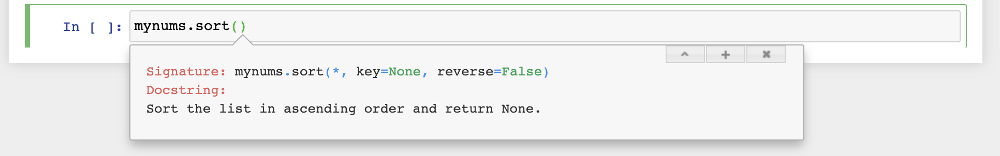
</div>

## Debugging with Jupyter Notebook

Let's first create an error:

```py
x = 1+1
y = 1-1
z = x/y
```

You should get a `ZeroDivisionError`.

<div style="margin-bottom:32px">
  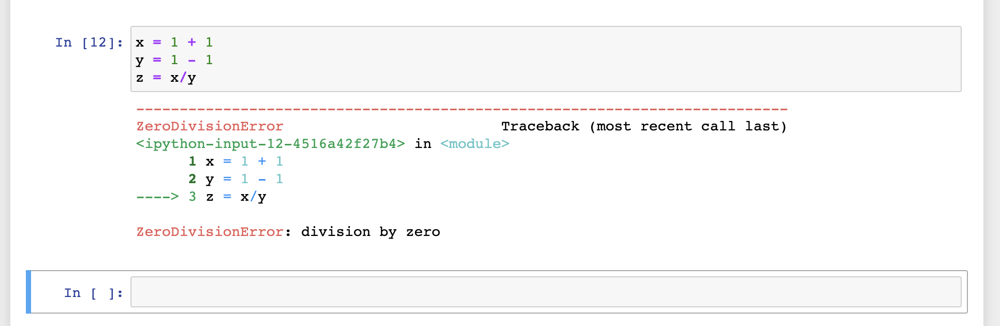
</div>

We want to debug this. In the next cell, type `%debug`. A dialog box will appear that will let you inspect your code without creating new cells. Anything you write here will *not* be saved in your notebook.

<div style="margin-bottom:32px">
  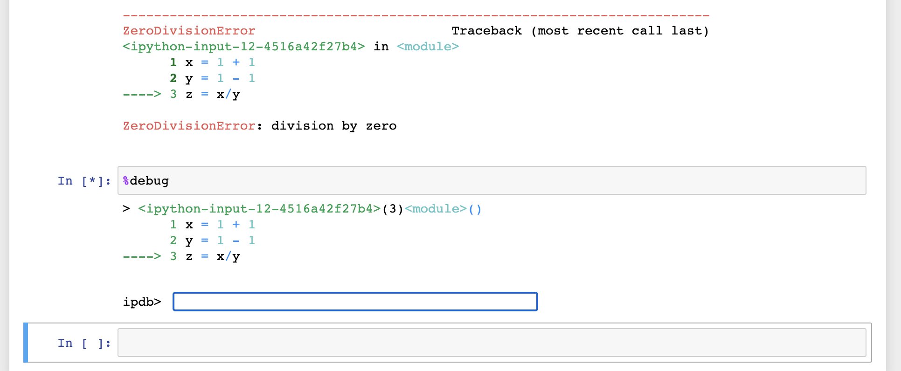
</div>

A reminder of what did not work appears below. You can start by checking on each of those variables to figure out which one is causing a zero divison error. In the `ipdb>` cell, inspect `x` by typing `x`.

<div style="margin-bottom:32px">
  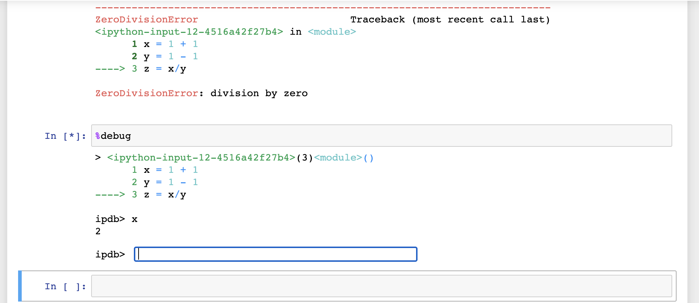
</div>

Looks like `x = 2` isn't the problem. Try `y`. <br />
The response should be `0`. Now we need to close the debug cell and get back to our program. To get out of debug mode, type `exit()` in the `ipdb>` cell.

<div style="margin-bottom:32px">
  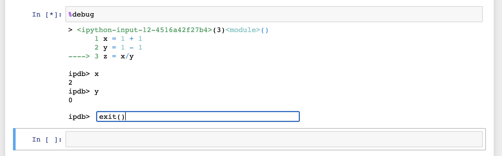
</div>

